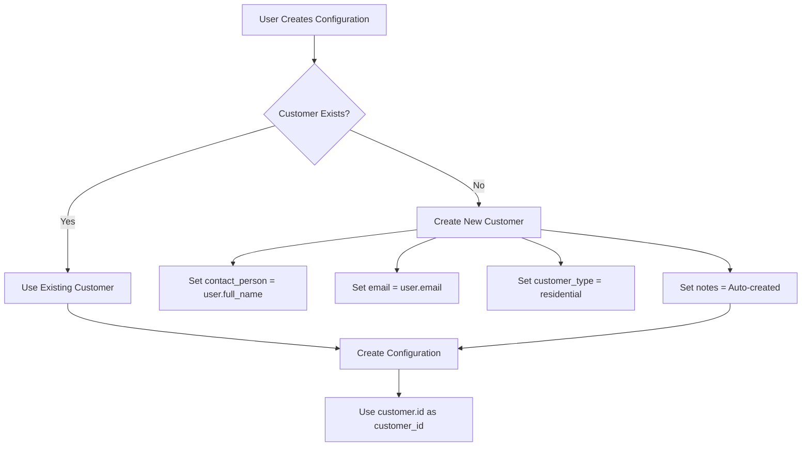

# Design Document

## Overview

This design addresses the architectural flaw where `user.id` is incorrectly used as `customer_id` in configurations, breaking the business model and database constraints. The solution implements proper User ↔ Customer relationships with auto-creation mechanisms and establishes a foundation for Role-Based Access Control (RBAC).

## Architecture

### Current Problem
```python
# ❌ BROKEN: Services use user.id as customer_id
config = Configuration(
    customer_id=user.id,  # References users table - WRONG!
    # ... other fields
)
```

### Proposed Solution
```python
# ✅ CORRECT: Services use proper customer.id
customer = await self._get_or_create_customer_for_user(user)
config = Configuration(
    customer_id=customer.id,  # References customers table - CORRECT!
    # ... other fields
)
```

## Components and Interfaces

### 1. Casbin RBAC Infrastructure

#### Casbin Service
```python
class Role(Enum):
    SUPERADMIN = "superadmin"
    SALESMAN = "salesman"
    DATA_ENTRY = "data_entry"
    PARTNER = "partner"
    CUSTOMER = "customer"

class Permission:
    """Permission definition for resources and actions."""
    
    def __init__(self, resource: str, action: str, context: Optional[dict] = None):
        self.resource = resource
        self.action = action
        self.context = context or {}
    
    def __str__(self):
        return f"{self.resource}:{self.action}"

class ResourceOwnership:
    """Resource ownership validation."""
    
    def __init__(self, resource_type: str, id_param: Optional[str] = None):
        self.resource_type = resource_type
        self.id_param = id_param or f"{resource_type}_id"
    
    def __str__(self):
        return f"ownership:{self.resource_type}"

class Role(Enum):
    """Enhanced Role enum with bitwise operations support."""
    SUPERADMIN = "superadmin"
    SALESMAN = "salesman"
    DATA_ENTRY = "data_entry"
    PARTNER = "partner"
    CUSTOMER = "customer"
    
    def __or__(self, other):
        """Support bitwise OR for role composition."""
        if isinstance(other, Role):
            return RoleComposition([self, other])
        elif isinstance(other, RoleComposition):
            return RoleComposition([self] + other.roles)
        return NotImplemented
    
    def __ror__(self, other):
        """Support reverse bitwise OR."""
        return self.__or__(other)

class RoleComposition:
    """Composed roles for cleaner syntax."""
    
    def __init__(self, roles: List[Role]):
        self.roles = roles
    
    def __or__(self, other):
        """Support chaining role compositions."""
        if isinstance(other, Role):
            return RoleComposition(self.roles + [other])
        elif isinstance(other, RoleComposition):
            return RoleComposition(self.roles + other.roles)
        return NotImplemented
    
    def __contains__(self, role: Role) -> bool:
        """Check if role is in composition."""
        return role in self.roles

class Privilege:
    """Reusable privilege definition bundling role, permission, and resource."""
    
    def __init__(
        self, 
        roles: Union[Role, RoleComposition, List[Role]], 
        permission: Permission, 
        resource: Optional[ResourceOwnership] = None
    ):
        if isinstance(roles, Role):
            self.roles = [roles]
        elif isinstance(roles, RoleComposition):
            self.roles = roles.roles
        else:
            self.roles = roles
        self.permission = permission
        self.resource = resource
    
    def __str__(self):
        role_names = [role.value for role in self.roles]
        return f"Privilege({role_names}, {self.permission}, {self.resource})"

class RBACService:
    def __init__(self):
        self.enforcer = casbin.Enforcer(
            "config/rbac_model.conf",
            "config/rbac_policy.csv"
        )
    
    async def check_permission(self, user: User, resource: str, action: str, context: dict = None) -> bool:
        """Check if user has permission for action on resource."""
    
    async def check_resource_ownership(self, user: User, resource_type: str, resource_id: int) -> bool:
        """Check if user owns or has access to the resource."""
    
    async def get_accessible_customers(self, user: User) -> List[int]:
        """Get list of customer IDs user can access."""
```

#### RBAC Decorators
```python
# Role-based authorization
@require(Role.SUPERADMIN)
async def admin_only_function():
    pass

# Permission-based authorization
@require(Permission("configuration", "read"))
async def read_configuration(configuration_id: int, user: User):
    pass

# Resource ownership authorization
@require(ResourceOwnership("configuration"))
async def update_my_configuration(configuration_id: int, user: User):
    pass

# Combined authorization (very common pattern)
@require(Role.SALESMAN, Permission("customer", "update"), ResourceOwnership("customer"))
async def update_customer(customer_id: int, user: User):
    pass

# Multiple roles with permission and ownership
@require([Role.SALESMAN, Role.PARTNER], Permission("quote", "create"), ResourceOwnership("customer"))
async def create_quote_for_customer(customer_id: int, user: User):
    pass
```

### 2. Enhanced Entry Service with Casbin

#### Customer Management Methods
```python
class EntryService(BaseService):
    async def _get_or_create_customer_for_user(self, user: User) -> Customer:
        """Get existing customer or create one for the user."""
        
    async def _find_customer_by_email(self, email: str) -> Customer | None:
        """Find existing customer by email address."""
        
    async def _create_customer_from_user(self, user: User) -> Customer:
        """Create new customer record from user data."""
```

#### Updated Configuration Methods with Advanced Decorators
```python
# Define reusable privileges for Entry Service
ConfigurationCreator = Privilege(
    roles=[Role.CUSTOMER, Role.SALESMAN, Role.PARTNER],
    permission=Permission("configuration", "create")
)

ConfigurationViewer = Privilege(
    roles=Role.CUSTOMER | Role.SALESMAN | Role.PARTNER,
    permission=Permission("configuration", "read"),
    resource=ResourceOwnership("configuration")
)

AdminAccess = Privilege(
    roles=Role.SUPERADMIN,
    permission=Permission("*", "*")
)

# Service methods with advanced decorators
@require(ConfigurationCreator)
async def save_profile_configuration(self, data: ProfileEntryData, user: User) -> Configuration:
    """Save configuration with proper customer relationship and RBAC."""
    
@require(ConfigurationViewer)
@require(AdminAccess)  # Admins can view any configuration
async def generate_preview_data(self, configuration_id: int, user: User) -> ProfilePreviewData:
    """Generate preview - customers/salesmen need ownership, admins have full access."""

# Different rules for different roles
@require(Role.SALESMAN, Permission("configuration", "update"), ResourceOwnership("customer"))
@require(Role.CUSTOMER, Permission("configuration", "update"), ResourceOwnership("configuration"))
@require(Role.SUPERADMIN, Permission("configuration", "update"))
async def update_configuration(self, configuration_id: int, data: ConfigurationUpdate, user: User) -> Configuration:
    """
    - Salesmen can update configurations for their assigned customers
    - Customers can update their own configurations  
    - Superadmins can update any configuration
    """
```

### 3. User Model Extensions with Casbin Integration

#### Role Support
```python
class Role(Enum):
    SUPERADMIN = "superadmin"
    SALESMAN = "salesman"
    DATA_ENTRY = "data_entry"
    PARTNER = "partner"
    CUSTOMER = "customer"

class User(Base):
    # ... existing fields
    role: Mapped[str] = mapped_column(
        String(50),
        default=Role.CUSTOMER.value,
        nullable=False,
        index=True
    )
    
    def has_role(self, role: Role) -> bool:
        """Check if user has specific role."""
        return self.role == role.value or self.role == Role.SUPERADMIN.value
```

#### Casbin Policy Integration
```python
# Initial Policy Configuration (All roles have full privileges initially)
# Policies stored in database via casbin_rule table

# Role assignments: g, user@email.com, role_name
# Permissions: p, role_name, resource, action, allow
# Customer assignments: g2, user@email.com, customer, customer_id

# Initial Policies (rbac_policy.csv):
# p, superadmin, *, *, allow
# p, salesman, *, *, allow     # Initially full privileges
# p, data_entry, *, *, allow   # Initially full privileges  
# p, partner, *, *, allow      # Initially full privileges
# p, customer, configuration, read|create, allow
# p, customer, quote, read, allow

# Role assignments (managed dynamically)
# g, admin@windx.com, superadmin
# g, sales@windx.com, salesman
# g, data@windx.com, data_entry
# g, partner@company.com, partner
```

### 3. Customer Auto-Creation Logic

#### Decision Flow


### 4. Decorator Authorization Logic

#### Advanced Decorator Patterns

##### Case 1: Multiple @require Decorators (OR Logic)
```python
# Different rules per role - any one decorator can allow access
@require(Role.SALESMAN, Permission("quote", "create"), ResourceOwnership("customer"))
@require(Role.PARTNER, Permission("quote", "create_partner"), ResourceOwnership("partner_customer"))
async def create_quote(customer_id: int, user: User):
    # Access granted if EITHER:
    # - User is SALESMAN with quote:create permission and owns customer OR
    # - User is PARTNER with quote:create_partner permission and owns partner_customer
    pass
```

##### Case 2: Shared Rules for Multiple Roles
```python
# Roles grouped to share same permission and resource rules
@require([Role.SALESMAN, Role.PARTNER], Permission("quote", "create"), ResourceOwnership("customer"))
async def create_quote_shared(customer_id: int, user: User):
    # Access granted if:
    # - User has SALESMAN OR PARTNER role AND
    # - User has quote:create permission AND
    # - User owns or has access to customer
    pass
```

##### Case 3: Role Composition (Bitwise Operators)
```python
# Define composed roles for cleaner syntax
QuoteCreators = Role.SALESMAN | Role.PARTNER
DataManagers = Role.DATA_ENTRY | Role.SUPERADMIN

@require(QuoteCreators, Permission("quote", "create"), ResourceOwnership("customer"))
async def create_quote_composed(customer_id: int, user: User):
    # Cleaner syntax for multiple role authorization
    pass

@require(DataManagers, Permission("manufacturing_type", "update"))
async def update_manufacturing_type(type_id: int, user: User):
    # Data entry staff and superadmins can update manufacturing types
    pass
```

##### Case 4: Privilege Abstraction (Recommended)
```python
# Bundle role, permission, and resource into reusable objects
class Privilege:
    def __init__(self, roles: Union[Role, List[Role]], permission: Permission, resource: Optional[ResourceOwnership] = None):
        self.roles = roles if isinstance(roles, list) else [roles]
        self.permission = permission
        self.resource = resource

# Define reusable privileges
QuoteManagement = Privilege(
    roles=[Role.SALESMAN, Role.PARTNER],
    permission=Permission("quote", "create"),
    resource=ResourceOwnership("customer")
)

ConfigurationManagement = Privilege(
    roles=Role.SALESMAN | Role.PARTNER,
    permission=Permission("configuration", "update"),
    resource=ResourceOwnership("customer")
)

AdminPrivileges = Privilege(
    roles=Role.SUPERADMIN,
    permission=Permission("*", "*")
)

# Usage with privilege objects
@require(QuoteManagement)
async def create_quote_privileged(customer_id: int, user: User):
    pass

@require(ConfigurationManagement)
async def update_configuration_privileged(configuration_id: int, user: User):
    pass

# Multiple privileges (OR logic between privileges)
@require(QuoteManagement)
@require(AdminPrivileges)
async def admin_or_quote_manager(customer_id: int, user: User):
    # Access granted if user has EITHER QuoteManagement OR AdminPrivileges
    pass
```

#### Decorator Evaluation Logic Summary
```python
# Multiple @require decorators = OR logic
@require(Privilege1)
@require(Privilege2)
def function():
    # Access granted if Privilege1 OR Privilege2 is satisfied

# Single @require with multiple roles = roles share same rules
@require([Role.A, Role.B], Permission(...), ResourceOwnership(...))
def function():
    # Access granted if (Role.A OR Role.B) AND Permission AND ResourceOwnership

# Role composition = cleaner syntax for role combinations
ComposedRole = Role.A | Role.B
@require(ComposedRole, Permission(...))
def function():
    # Same as above but with cleaner syntax
```

#### Decorator Implementation Engine
```python
def require(*requirements) -> callable:
    """
    Advanced decorator supporting multiple authorization patterns.
    
    Evaluation Logic:
    - Multiple @require decorators on same function = OR logic
    - Multiple requirements in single @require = AND logic  
    - Multiple roles in single requirement = OR logic for roles
    """
    def decorator(func):
        # Get existing requirements from previous decorators
        existing_requirements = getattr(func, '_rbac_requirements', [])
        
        # Add new requirements (creates OR relationship with existing)
        all_requirements = existing_requirements + [requirements]
        
        @wraps(func)
        async def wrapper(*args, **kwargs):
            user = await _extract_user_from_args(args, kwargs)
            
            # Evaluate requirements with OR logic between decorator groups
            for requirement_group in all_requirements:
                if await _evaluate_requirement_group(user, requirement_group, func, args, kwargs):
                    # At least one requirement group satisfied - allow access
                    return await func(*args, **kwargs)
            
            # No requirement group satisfied - deny access
            raise HTTPException(status_code=403, detail="Access denied")
        
        # Store requirements for potential additional decorators
        wrapper._rbac_requirements = all_requirements
        return wrapper
    return decorator

async def _evaluate_requirement_group(user: User, requirements: tuple, func: callable, args: tuple, kwargs: dict) -> bool:
    """Evaluate a single requirement group with AND logic."""
    
    role_satisfied = False
    permission_satisfied = True
    ownership_satisfied = True
    
    for requirement in requirements:
        if isinstance(requirement, (Role, RoleComposition, list)):
            # Role requirement
            role_satisfied = await _check_role_requirement(user, requirement)
        
        elif isinstance(requirement, Permission):
            # Permission requirement
            permission_satisfied = await _check_permission_requirement(user, requirement)
        
        elif isinstance(requirement, ResourceOwnership):
            # Ownership requirement
            ownership_satisfied = await _check_ownership_requirement(user, requirement, func, args, kwargs)
        
        elif isinstance(requirement, Privilege):
            # Privilege requirement (contains role + permission + ownership)
            return await _check_privilege_requirement(user, requirement, func, args, kwargs)
    
    # All requirements in group must be satisfied (AND logic)
    return role_satisfied and permission_satisfied and ownership_satisfied

async def _check_role_requirement(user: User, role_req: Union[Role, RoleComposition, List[Role]]) -> bool:
    """Check role requirement with OR logic for multiple roles."""
    if isinstance(role_req, Role):
        return user.role == role_req.value or user.role == Role.SUPERADMIN.value
    
    elif isinstance(role_req, RoleComposition):
        return any(user.role == role.value for role in role_req.roles) or user.role == Role.SUPERADMIN.value
    
    elif isinstance(role_req, list):
        return any(user.role == role.value for role in role_req) or user.role == Role.SUPERADMIN.value
    
    return False
```

#### Resource Ownership Resolution
```python
# Automatic ID parameter detection
@require(ResourceOwnership("configuration"))
async def update_config(configuration_id: int, user: User):
    # Automatically extracts configuration_id and validates ownership

@require(ResourceOwnership("customer", "cust_id"))  
async def update_customer(cust_id: int, user: User):
    # Uses custom parameter name "cust_id" instead of default "customer_id"

# Indirect ownership (through relationships)
@require(ResourceOwnership("customer"))  # Validates via configuration -> customer
async def update_config(configuration_id: int, user: User):
    # Looks up configuration.customer_id and validates user access to that customer
```

### 5. Template RBAC Integration

#### Template Context Functions
```python
# Template context processor for RBAC
async def rbac_context_processor(request):
    """Add RBAC functions to template context."""
    user = request.user
    rbac = RBACService()
    
    # Cache for request scope
    permission_cache = {}
    
    async def cached_check_permission(resource: str, action: str) -> bool:
        cache_key = f"{user.id}:{resource}:{action}"
        if cache_key not in permission_cache:
            permission_cache[cache_key] = await rbac.check_permission(user, resource, action)
        return permission_cache[cache_key]
    
    async def cached_check_ownership(resource_type: str, resource_id: int) -> bool:
        cache_key = f"{user.id}:owns:{resource_type}:{resource_id}"
        if cache_key not in permission_cache:
            permission_cache[cache_key] = await rbac.check_resource_ownership(user, resource_type, resource_id)
        return permission_cache[cache_key]
    
    return {
        'rbac': {
            'can': cached_check_permission,
            'has_role': lambda role: user.role == role.value if isinstance(role, Role) else user.role == role or user.role == Role.SUPERADMIN.value,
            'owns': cached_check_ownership,
            'has_privilege': lambda privilege: rbac.check_privilege(user, privilege),
            'user_role': user.role,
            'is_superadmin': user.role == Role.SUPERADMIN.value
        }
    }
```

#### Template Usage Examples
```html
<!-- Jinja2 Template Examples -->

<!-- Role-based UI elements -->

  <div class="salesman-dashboard">
    <h2>Sales Dashboard</h2>
    <button class="btn-primary">Manage Customers</button>
  </div>



  <div class="data-management">
    <button class="btn-secondary">Manage Manufacturing Types</button>
    <button class="btn-secondary">Manage Templates</button>
  </div>


<!-- Permission-based actions -->

  <button class="btn-create" onclick="createConfiguration()">
    Create New Configuration
  </button>



  <button class="btn-quote" onclick="generateQuote()">
    Generate Quote
  </button>


<!-- Resource ownership checks -->

  <div class="config-card">
    <h3>{{ config.name }}</h3>
    
    
      <div class="config-actions">
        <button onclick="editConfig({{ config.id }})">Edit</button>
        <button onclick="deleteConfig({{ config.id }})">Delete</button>
      </div>
    
    
    
      <button onclick="createQuote({{ config.id }})">Create Quote</button>
    
  </div>


<!-- Complex permission combinations -->

  <div class="customer-management">
    <h3>Customer Management</h3>
    <!-- Customer management UI -->
  </div>


<!-- Conditional navigation -->
<nav class="main-nav">
  <a href="/dashboard">Dashboard</a>
  
  
    <a href="/configurations">Configurations</a>
  
  
  
    <a href="/quotes">Quotes</a>
  
  
  
    <a href="/admin">Administration</a>
  
  
  
    <a href="/data-management">Data Management</a>
  
</nav>
```

#### Advanced Template Patterns
```html
<!-- Role-specific content sections -->


<div class="user-info">
  <span class="user-role">{{ user_roles[rbac.user_role] }}</span>
  
  
    <span class="badge badge-admin">Admin</span>
  
</div>

<!-- Dynamic menu based on permissions -->


<ul class="nav-menu">
  
    
    
    
      
    
      
    
      
    
    
    
      <li><a href="{{ item.url }}">{{ item.label }}</a></li>
    
  
</ul>
```

### 6. Casbin Authorization Updates

#### Current Authorization (Broken)
```python
# ❌ WRONG: Manual authorization checks
if not user.is_superuser and config.customer_id != user.id:
    raise AuthorizationException()
```

#### New Casbin Authorization (Professional)
```python
# ✅ CORRECT: Casbin decorator handles everything
@require(Permission("configuration", "read"))
async def get_configuration(configuration_id: int, user: User) -> Configuration:
    # Casbin automatically:
    # 1. Checks user role permissions
    # 2. Extracts customer_id from configuration_id
    # 3. Validates customer ownership
    # 4. Raises 403 if unauthorized
    return await self.config_repo.get(configuration_id)
```

#### Automatic Query Filtering
```python
# ✅ CORRECT: Automatic RBAC filtering
async def get_configurations(self, user: User) -> List[Configuration]:
    query = select(Configuration)
    # Automatically filters by accessible customers
    query = await RBACQueryFilter.filter_configurations(query, user)
    result = await self.db.execute(query)
    return result.scalars().all()
```

### 4. Service Layer Updates with Casbin

#### Configuration Service with Casbin Decorators
```python
class ConfigurationService(BaseService):
    @require(Permission("configuration", "create"))
    async def create_configuration(self, data: ConfigurationCreate, user: User) -> Configuration:
        # Get or create customer for user
        customer = await self._get_customer_for_user(user)
        
        # Create configuration with proper customer_id
        config_data = data.model_dump()
        config = Configuration(**config_data, customer_id=customer.id)
        
        self.config_repo.db.add(config)
        await self.commit()
        return config
    
    @require(Permission("configuration", "read"))
    async def get_configurations(self, user: User, filters: dict = None) -> List[Configuration]:
        # Casbin automatically filters by accessible customers
        query = select(Configuration)
        query = await RBACQueryFilter.filter_configurations(query, user)
        
        if filters:
            query = self._apply_filters(query, filters)
        
        result = await self.db.execute(query)
        return result.scalars().all()
    
    @require(Permission("configuration", "update"))
    async def update_configuration(self, config_id: int, data: ConfigurationUpdate, user: User) -> Configuration:
        # Casbin decorator automatically validates customer ownership
        config = await self.config_repo.get(config_id)
        # Update logic here
        return config
```

#### Quote Service with Casbin Decorators
```python
class QuoteService(BaseService):
    @require(Permission("quote", "create"))
    async def create_quote(self, data: QuoteCreate, user: User) -> Quote:
        # Casbin validates user can create quotes for this customer
        pass
    
    @require(Permission("quote", "read"))
    async def get_quotes(self, user: User) -> List[Quote]:
        # Automatic filtering by accessible customers
        query = select(Quote)
        query = await RBACQueryFilter.filter_quotes(query, user)
        result = await self.db.execute(query)
        return result.scalars().all()
```

#### Automatic Query Filtering
```python
class RBACQueryFilter:
    @staticmethod
    async def filter_configurations(query: Select, user: User) -> Select:
        """Filter configurations based on user access."""
        if user.role == Role.SUPERADMIN.value:
            return query
        
        accessible_customers = await rbac_service.get_accessible_customers(user)
        return query.where(Configuration.customer_id.in_(accessible_customers))
    
    @staticmethod
    async def filter_quotes(query: Select, user: User) -> Select:
        """Filter quotes based on user access."""
        if user.role == Role.SUPERADMIN.value:
            return query
        
        accessible_customers = await rbac_service.get_accessible_customers(user)
        return query.where(Quote.customer_id.in_(accessible_customers))
```

## Data Models

### User-Customer Relationship
```python
# One-to-One relationship (for entry page users)
User.email ←→ Customer.email

# Future: Many-to-Many (for company accounts)
User ←→ UserCustomerAssignment ←→ Customer
```

### Customer Auto-Creation Mapping
```python
User Data → Customer Data:
- user.full_name → customer.contact_person
- user.username → customer.contact_person (fallback)
- user.email → customer.email
- "residential" → customer.customer_type
- True → customer.is_active
- f"Auto-created from user: {user.username}" → customer.notes
```

## Correctness Properties

*A property is a characteristic or behavior that should hold true across all valid executions of a system-essentially, a formal statement about what the system should do. Properties serve as the bridge between human-readable specifications and machine-verifiable correctness guarantees.*

### Property 1: Customer Relationship Integrity
*For any* configuration created through the entry service, the customer_id field should reference a valid customer record, not a user record
**Validates: Requirements 1.2, 1.5**

### Property 2: User-Customer Mapping Consistency  
*For any* user who creates configurations, there should exist exactly one associated customer record with matching email
**Validates: Requirements 1.1, 1.3, 1.4**

### Property 3: Authorization Customer Ownership
*For any* configuration access attempt by a non-superuser, the user's associated customer should own the configuration
**Validates: Requirements 2.3, 6.1**

### Property 4: Customer Auto-Creation Idempotency
*For any* user, calling get_or_create_customer_for_user multiple times should return the same customer record
**Validates: Requirements 1.4, 5.3**

### Property 5: Foreign Key Constraint Satisfaction
*For any* configuration saved through the entry service, the customer_id should satisfy database foreign key constraints
**Validates: Requirements 1.5, 2.1**

### Property 6: Role Assignment Validity
*For any* user in the system, the role field should contain a valid UserRole enum value
**Validates: Requirements 3.3, 3.4**

### Property 7: Backward Compatibility Preservation
*For any* existing system functionality, the customer relationship updates should not break current operations
**Validates: Requirements 5.1, 5.2, 5.5**

### Property 8: Customer Data Consistency
*For any* auto-created customer, the contact information should accurately reflect the source user data
**Validates: Requirements 1.3, 4.2**

### Property 9: Casbin Policy Consistency
*For any* user role and resource access attempt, Casbin policy evaluation should return consistent results
**Validates: Requirements 3.3, 3.4, 6.1**

### Property 10: Decorator Authorization Consistency
*For any* method decorated with `@require()`, unauthorized access should raise HTTPException with status 403
**Validates: Requirements 3.3, 3.4, 6.1**

### Property 11: Template RBAC Function Consistency
*For any* template RBAC function call, the result should match the corresponding backend Casbin policy evaluation
**Validates: Requirements 10.1, 10.2, 10.3**

## Error Handling

### Customer Creation Failures
```python
try:
    customer = await self._create_customer_from_user(user)
except IntegrityError as e:
    if "unique constraint" in str(e):
        # Handle race condition - another process created customer
        customer = await self._find_customer_by_email(user.email)
        if not customer:
            raise DatabaseException("Failed to create or find customer")
    else:
        raise DatabaseException(f"Customer creation failed: {e}")
```

### Casbin Authorization Failures
```python
class CasbinAuthorizationException(HTTPException):
    """Raised when Casbin policy evaluation denies access."""
    
    def __init__(self, user_email: str, resource: str, action: str):
        super().__init__(
            status_code=403,
            detail=f"User {user_email} not authorized for {action} on {resource}"
        )

class PolicyEvaluationException(Exception):
    """Raised when Casbin policy evaluation fails."""
    
    def __init__(self, error: str):
        super().__init__(f"Policy evaluation failed: {error}")
```

### Foreign Key Constraint Violations
```python
try:
    configuration = Configuration(**config_data)
    self.db.add(configuration)
    await self.commit()
except IntegrityError as e:
    if "customer_id_fkey" in str(e):
        raise ValidationException(
            "Invalid customer reference", 
            {"customer_id": "Customer not found"}
        )
    raise
```

## Testing Strategy

### Unit Testing
- Test customer auto-creation logic with various user data scenarios
- Test User-Customer mapping edge cases (missing email, duplicate emails)
- Test role assignment and validation
- **Test Casbin decorator functionality with different roles and permissions**
- **Test RBACService policy evaluation with various scenarios**
- **Test context extraction for customer ownership validation**
- Test authorization logic with different user-customer relationships

### Property-Based Testing
- Generate random user data and verify customer creation consistency
- Test configuration creation with random user-customer combinations
- **Verify Casbin policy evaluation consistency across random access patterns**
- **Test decorator authorization properties with generated user-role combinations**
- Verify authorization properties across different access patterns
- Test foreign key constraint satisfaction with generated data

### Integration Testing
- Test complete entry page workflow with customer auto-creation
- Test cross-service customer relationship consistency
- **Test end-to-end Casbin authorization workflows**
- **Test policy management and dynamic customer assignments**
- **Test RBACQueryFilter automatic filtering across services**
- Test database constraint enforcement
- Test role-based access scenarios

### Migration Testing
- Test system behavior with existing configurations
- Test mixed scenarios (some users have customers, others don't)
- Test performance impact of customer lookups
- Test rollback scenarios for failed customer creation

## Performance Considerations

### Database Optimization
```sql
-- Index for efficient customer lookup by email
CREATE INDEX idx_customers_email ON customers(email);

-- Index for user role filtering
CREATE INDEX idx_users_role ON users(role);

-- Composite index for customer-configuration queries
CREATE INDEX idx_configurations_customer_status ON configurations(customer_id, status);
```

### Caching Strategy
```python
# Cache customer lookups within request scope
@lru_cache(maxsize=128)
async def get_customer_for_user_cached(self, user_id: int) -> Customer:
    """Cached customer lookup for performance."""

# Cache Casbin policy evaluations
@lru_cache(maxsize=256)
def cache_policy_evaluation(user_email: str, resource: str, action: str) -> bool:
    """Cached Casbin policy evaluation for performance."""

# Cache accessible customers for user
@lru_cache(maxsize=128)
async def get_accessible_customers_cached(self, user_id: int) -> List[int]:
    """Cached accessible customers lookup for performance."""
```

### Query Optimization
```python
# Eager load customer data to avoid N+1 queries
stmt = (
    select(Configuration)
    .options(selectinload(Configuration.customer))
    .where(Configuration.id == config_id)
)
```

## Security Implications

### Casbin RBAC Security
- **Professional authorization engine with proven security model**
- **Policy-based access control with explicit allow/deny rules**
- **Context-aware permissions with customer ownership validation**
- **Automatic query filtering prevents data leakage**
- Replace manual authorization checks with Casbin decorators
- Maintain superuser bypass through policy configuration
- Add audit logging for policy changes and customer relationship updates

### Data Privacy
- Ensure customer auto-creation doesn't expose sensitive user data
- Maintain separation between system accounts (users) and business entities (customers)
- **Casbin policies stored securely in database with encryption at rest**
- **Role-based data access prevents unauthorized customer data exposure**
- Log customer creation events and policy evaluations for compliance

### Enterprise RBAC Foundation
- **Casbin supports complex authorization models (RBAC, ABAC, ACL)**
- **Dynamic policy management for runtime permission updates**
- **Customer assignment workflows for salesmen and partners**
- **Scalable to multi-tenant and enterprise scenarios**
- Extensible design supports complex authorization scenarios

## Migration Path

### Phase 1: Casbin RBAC Infrastructure
1. **Install Casbin and database adapter dependencies**
2. **Create Casbin model and policy configuration files**
3. **Implement RBACService with Casbin enforcer**
4. **Create RBAC decorators (@require) with role and permission support**
5. Add role field to User model
6. **Setup policy storage in database**

### Phase 2: Core Implementation with Casbin
1. **Update Entry Service with Casbin decorators and customer auto-creation**
2. Fix customer_id usage in configurations
3. **Replace manual authorization checks with Casbin decorators**
4. **Implement RBACQueryFilter for automatic query filtering**

### Phase 3: Service Updates with Casbin
1. **Update Configuration Service with @require decorators**
2. **Update Quote Service with @require decorators**
3. **Update Order Service with @require decorators**
4. **Update Template Service with @require decorators**
5. **Add automatic RBAC filtering to all list operations**

### Phase 4: Testing & Validation
1. **Comprehensive Casbin policy testing**
2. **Property-based testing for decorator authorization**
3. Performance validation (including Casbin evaluation overhead)
4. Security audit of RBAC implementation
5. Documentation updates

### Phase 5: Advanced RBAC Features
1. **Dynamic policy management interface**
2. **Customer assignment workflows for salesmen/partners**
3. **Advanced authorization scenarios (time-based, attribute-based)**
4. **Multi-tenant policy isolation**
5. **Policy backup and restore functionality**