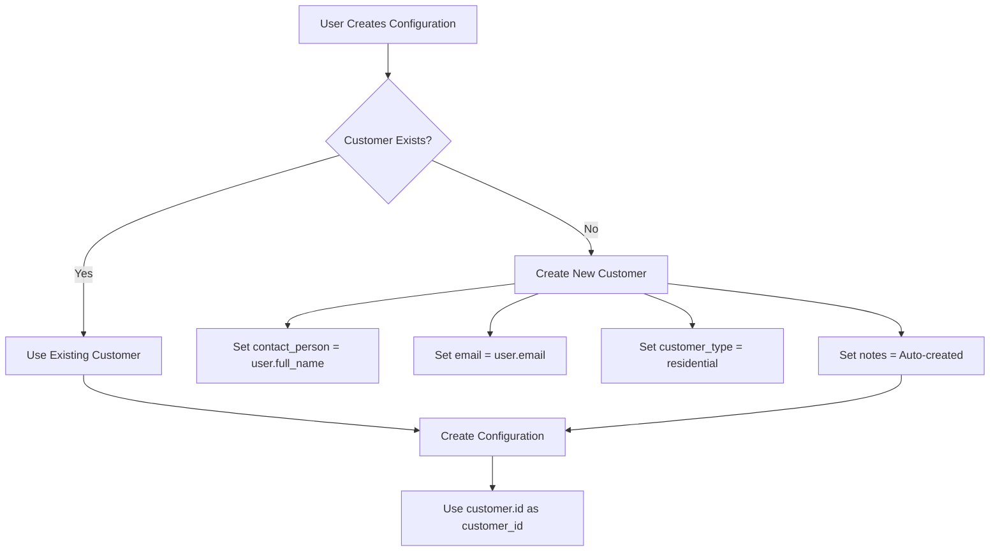

# Design Document

## Overview

This design addresses the architectural flaw where `user.id` is incorrectly used as `customer_id` in configurations, breaking the business model and database constraints. The solution implements proper User ↔ Customer relationships with auto-creation mechanisms and establishes a foundation for Role-Based Access Control (RBAC).

## Architecture

### Current Problem
```python
# ❌ BROKEN: Services use user.id as customer_id
config = Configuration(
    customer_id=user.id,  # References users table - WRONG!
    # ... other fields
)
```

### Proposed Solution
```python
# ✅ CORRECT: Services use proper customer.id
customer = await self._get_or_create_customer_for_user(user)
config = Configuration(
    customer_id=customer.id,  # References customers table - CORRECT!
    # ... other fields
)
```

## Components and Interfaces

### 1. Enhanced Entry Service

#### Customer Management Methods
```python
class EntryService(BaseService):
    async def _get_or_create_customer_for_user(self, user: User) -> Customer:
        """Get existing customer or create one for the user."""
        
    async def _find_customer_by_email(self, email: str) -> Customer | None:
        """Find existing customer by email address."""
        
    async def _create_customer_from_user(self, user: User) -> Customer:
        """Create new customer record from user data."""
```

#### Updated Configuration Methods
```python
async def save_profile_configuration(self, data: ProfileEntryData, user: User) -> Configuration:
    """Save configuration with proper customer relationship."""
    
async def generate_preview_data(self, configuration_id: int, user: User) -> ProfilePreviewData:
    """Generate preview with customer-based authorization."""
```

### 2. User Model Extensions

#### Role Support
```python
class UserRole(str, Enum):
    SUPERADMIN = "superadmin"
    SALESMAN = "salesman"
    DATA_ENTRY = "data_entry"
    PARTNER = "partner"
    CUSTOMER = "customer"

class User(Base):
    # ... existing fields
    role: Mapped[str] = mapped_column(
        String(50),
        default=UserRole.CUSTOMER,
        nullable=False,
        index=True
    )
```

### 3. Customer Auto-Creation Logic

#### Decision Flow


### 4. Authorization Updates

#### Current Authorization (Broken)
```python
# ❌ WRONG: Compares config.customer_id with user.id
if not user.is_superuser and config.customer_id != user.id:
    raise AuthorizationException()
```

#### New Authorization (Correct)
```python
# ✅ CORRECT: Uses User-Customer mapping
if not user.is_superuser:
    user_customer = await self._get_or_create_customer_for_user(user)
    if config.customer_id != user_customer.id:
        raise AuthorizationException()
```

## Data Models

### User-Customer Relationship
```python
# One-to-One relationship (for entry page users)
User.email ←→ Customer.email

# Future: Many-to-Many (for company accounts)
User ←→ UserCustomerAssignment ←→ Customer
```

### Customer Auto-Creation Mapping
```python
User Data → Customer Data:
- user.full_name → customer.contact_person
- user.username → customer.contact_person (fallback)
- user.email → customer.email
- "residential" → customer.customer_type
- True → customer.is_active
- f"Auto-created from user: {user.username}" → customer.notes
```

## Correctness Properties

*A property is a characteristic or behavior that should hold true across all valid executions of a system-essentially, a formal statement about what the system should do. Properties serve as the bridge between human-readable specifications and machine-verifiable correctness guarantees.*

### Property 1: Customer Relationship Integrity
*For any* configuration created through the entry service, the customer_id field should reference a valid customer record, not a user record
**Validates: Requirements 1.2, 1.5**

### Property 2: User-Customer Mapping Consistency  
*For any* user who creates configurations, there should exist exactly one associated customer record with matching email
**Validates: Requirements 1.1, 1.3, 1.4**

### Property 3: Authorization Customer Ownership
*For any* configuration access attempt by a non-superuser, the user's associated customer should own the configuration
**Validates: Requirements 2.3, 6.1**

### Property 4: Customer Auto-Creation Idempotency
*For any* user, calling get_or_create_customer_for_user multiple times should return the same customer record
**Validates: Requirements 1.4, 5.3**

### Property 5: Foreign Key Constraint Satisfaction
*For any* configuration saved through the entry service, the customer_id should satisfy database foreign key constraints
**Validates: Requirements 1.5, 2.1**

### Property 6: Role Assignment Validity
*For any* user in the system, the role field should contain a valid UserRole enum value
**Validates: Requirements 3.3, 3.4**

### Property 7: Backward Compatibility Preservation
*For any* existing system functionality, the customer relationship updates should not break current operations
**Validates: Requirements 5.1, 5.2, 5.5**

### Property 8: Customer Data Consistency
*For any* auto-created customer, the contact information should accurately reflect the source user data
**Validates: Requirements 1.3, 4.2**

## Error Handling

### Customer Creation Failures
```python
try:
    customer = await self._create_customer_from_user(user)
except IntegrityError as e:
    if "unique constraint" in str(e):
        # Handle race condition - another process created customer
        customer = await self._find_customer_by_email(user.email)
        if not customer:
            raise DatabaseException("Failed to create or find customer")
    else:
        raise DatabaseException(f"Customer creation failed: {e}")
```

### Authorization Failures
```python
class CustomerAuthorizationException(AuthorizationException):
    """Raised when user lacks access to customer resources."""
    
    def __init__(self, user_id: int, customer_id: int):
        super().__init__(
            f"User {user_id} not authorized to access customer {customer_id} resources"
        )
```

### Foreign Key Constraint Violations
```python
try:
    configuration = Configuration(**config_data)
    self.db.add(configuration)
    await self.commit()
except IntegrityError as e:
    if "customer_id_fkey" in str(e):
        raise ValidationException(
            "Invalid customer reference", 
            {"customer_id": "Customer not found"}
        )
    raise
```

## Testing Strategy

### Unit Testing
- Test customer auto-creation logic with various user data scenarios
- Test User-Customer mapping edge cases (missing email, duplicate emails)
- Test role assignment and validation
- Test authorization logic with different user-customer relationships

### Property-Based Testing
- Generate random user data and verify customer creation consistency
- Test configuration creation with random user-customer combinations
- Verify authorization properties across different access patterns
- Test foreign key constraint satisfaction with generated data

### Integration Testing
- Test complete entry page workflow with customer auto-creation
- Test cross-service customer relationship consistency
- Test database constraint enforcement
- Test role-based access scenarios

### Migration Testing
- Test system behavior with existing configurations
- Test mixed scenarios (some users have customers, others don't)
- Test performance impact of customer lookups
- Test rollback scenarios for failed customer creation

## Performance Considerations

### Database Optimization
```sql
-- Index for efficient customer lookup by email
CREATE INDEX idx_customers_email ON customers(email);

-- Index for user role filtering
CREATE INDEX idx_users_role ON users(role);

-- Composite index for customer-configuration queries
CREATE INDEX idx_configurations_customer_status ON configurations(customer_id, status);
```

### Caching Strategy
```python
# Cache customer lookups within request scope
@lru_cache(maxsize=128)
async def get_customer_for_user_cached(self, user_id: int) -> Customer:
    """Cached customer lookup for performance."""
```

### Query Optimization
```python
# Eager load customer data to avoid N+1 queries
stmt = (
    select(Configuration)
    .options(selectinload(Configuration.customer))
    .where(Configuration.id == config_id)
)
```

## Security Implications

### Access Control Updates
- Replace user.id comparisons with customer.id comparisons
- Maintain superuser bypass for administrative access
- Add audit logging for customer relationship changes

### Data Privacy
- Ensure customer auto-creation doesn't expose sensitive user data
- Maintain separation between system accounts (users) and business entities (customers)
- Log customer creation events for compliance

### Future RBAC Foundation
- Role field enables future permission restrictions
- Customer assignments prepare for salesman/partner role limitations
- Extensible design supports complex authorization scenarios

## Migration Path

### Phase 1: Core Implementation
1. Update Entry Service with customer auto-creation
2. Fix customer_id usage in configurations
3. Update authorization checks
4. Add role field to User model

### Phase 2: Service Updates
1. Update Configuration Service
2. Update Quote Service  
3. Update Order Service
4. Update Template Service

### Phase 3: Testing & Validation
1. Comprehensive test coverage
2. Performance validation
3. Security audit
4. Documentation updates

### Phase 4: Future Enhancements
1. Implement role-based restrictions
2. Add customer assignment management
3. Advanced authorization workflows
4. Multi-tenant support