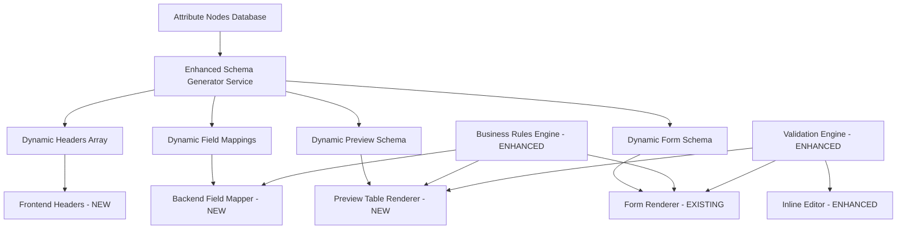

# Design Document

## Overview

The Entry Page Schema-Driven Refactor addresses critical architectural inconsistencies in the current Windx Entry Page system. While the system was designed to be **schema-driven** and **fully dynamic**, the current implementation has a **dual architecture** where forms are properly schema-driven but previews use hardcoded mappings, breaking the design principle.

**Current State Analysis:**
- ✅ **Forms**: Properly schema-driven using `generate_form_schema()` from attribute nodes
- ❌ **Previews**: Hardcoded 29-column array and static field mappings in `profile-entry.js`
- ❌ **Field Ordering**: Database defines Material (sort_order=4) before Company (sort_order=3), but frontend shows Company before Material
- ❌ **Business Rules**: Conditional logic exists but `isFieldValidForCurrentContext()` returns `true` for all fields
- ❌ **Column Count**: System assumes exactly 29 columns, breaks if 30th column added

**Root Cause:** Preview functionality was implemented with hardcoded shortcuts to meet deadlines, creating architectural inconsistency.

This refactoring transforms the system into a **unified schema-driven architecture** by:

1. **Eliminating Hardcoded Preview Headers** - Replace 29-column array with dynamic generation
2. **Removing Hardcoded Backend Mappings** - Generate `HEADER_MAPPING` from schema dynamically  
3. **Fixing Field Ordering Inconsistency** - Ensure all components respect database `sort_order`
4. **Implementing Type-Based Validation** - Enable business rule engine for conditional fields
5. **Supporting Dynamic Column Count** - Handle any number of fields gracefully
6. **Adding Search/Filter Functionality** - Comprehensive search across all columns
7. **Enhancing Inline Edit Validation** - Field-type aware editing with proper validation
8. **Providing Specific Error Messages** - Replace generic "Validation Error" with field-specific errors
9. **Creating Template Reusability** - Base templates for accessories/glazing pages
10. **Enabling JavaScript Reusability** - Parameterized Alpine.js components for all entry types

This refactoring maintains backward compatibility while enabling the system to scale to new product types without code changes. 

## Architecture

### Current Architecture Problems

The existing system has a **dual architecture** that creates maintenance overhead and breaks the intended schema-driven design:

**Current Implementation Analysis:**
```
┌─────────────────┐    ┌─────────────────┐
│   Form System   │    │ Preview System  │
│  (Schema-driven)│    │  (Hardcoded)    │
│     ✅ GOOD     │    │    ❌ BROKEN    │
└─────────────────┘    └─────────────────┘
         │                       │
         ▼                       ▼
┌─────────────────┐    ┌─────────────────┐
│ AttributeNode   │    │ HEADER_MAPPING  │
│ Database Schema │    │ Static Dict     │
│ Dynamic Fields  │    │ 29 Hardcoded   │
└─────────────────┘    └─────────────────┘
```

**Specific Problems Identified:**

1. **Hardcoded Preview Headers** (`profile-entry.js` lines 1050+):
   ```javascript
   get previewHeaders() {
       return [
           "Name", "Type", "Company", "Material", "opening system", "system series",
           // ... 29 hardcoded columns
       ];
   }
   ```

2. **Hardcoded Backend Mappings** (`app/services/entry.py` lines 870-897):
   ```python
   HEADER_MAPPING = {
       "id": "id",
       "Name": "name",
       "Type": "type",
       "Company": "company",
       # ... 29 hardcoded mappings
   }
   ```

3. **Field Ordering Inconsistency**:
   - Database: `material` (sort_order=4), `company` (sort_order=3)
   - Frontend: Company appears before Material in preview
   - Root cause: Hardcoded arrays don't respect database ordering

4. **Broken Business Rules**:
   ```javascript
   // profile-entry.js
   isFieldValidForCurrentContext(field) {
       // Add logic here to determine if field is valid
       // For now, return true for all fields, but this can be extended
       return true; // ❌ Always returns true!
   }
   ```

5. **Static Column Assumptions**:
   - Tests assume exactly 29 columns
   - System breaks if 30th column added
   - No flexibility for different manufacturing types

### Target Architecture

The refactored system implements a **unified schema-driven architecture**:



**Key Architectural Changes:**

1. **Single Source of Truth**: All UI components derive from `attribute_nodes` table
2. **Dynamic Header Generation**: Replace hardcoded arrays with database-driven headers
3. **Unified Field Ordering**: All components respect database `sort_order` consistently
4. **Enhanced Business Rules**: Implement proper conditional field logic
5. **Template Reusability**: Create base templates for accessories/glazing pages

**Before vs After:**

| Component | Before (Hardcoded) | After (Schema-Driven) |
|-----------|-------------------|----------------------|
| Preview Headers | 29-item static array | Generated from attribute nodes |
| Field Mappings | Static dictionary | Generated from schema |
| Field Ordering | Inconsistent | Database `sort_order` everywhere |
| Column Count | Fixed at 29 | Dynamic based on schema |
| Business Rules | Always returns `true` | Proper conditional evaluation |
| New Entry Types | Full code duplication | Minimal configuration |

### Key Architectural Decisions

**Decision 1: Eliminate Hardcoded Arrays**
- **Current Problem**: `previewHeaders` array hardcoded with 29 columns
- **Solution**: Generate headers dynamically from attribute nodes with proper ordering
- **Impact**: System can handle any number of fields without code changes
- **Trade-off**: Slightly more complex initial setup, but dramatically easier maintenance

**Decision 2: Fix Field Ordering Inconsistency**
- **Current Problem**: Database says Material (sort_order=4) before Company (sort_order=3), but frontend shows Company first
- **Solution**: All components use database `sort_order` as single source of truth
- **Impact**: Consistent field ordering across forms, previews, and all components
- **Trade-off**: Requires updating existing hardcoded arrays, but ensures consistency

**Decision 3: Implement Real Business Rules Engine**
- **Current Problem**: `isFieldValidForCurrentContext()` always returns `true`
- **Solution**: Proper evaluation of `display_condition` JSONB rules from attribute nodes
- **Impact**: Fields properly show/hide based on Type selection and other conditions
- **Trade-off**: More complex conditional logic, but enables proper business rule enforcement

**Decision 4: Dynamic Backend Mappings**
- **Current Problem**: `HEADER_MAPPING` dictionary hardcoded with 29 entries
- **Solution**: Generate mapping from schema dynamically using field labels and names
- **Impact**: Eliminates manual synchronization between frontend and backend
- **Trade-off**: Additional abstraction layer, but single source of truth

**Decision 5: Template and JavaScript Reusability**
- **Current Problem**: 400+ lines of template code specific to profile page
- **Solution**: Create reusable base template and parameterized Alpine.js app
- **Impact**: Easy creation of accessories/glazing pages with minimal code
- **Trade-off**: More complex template structure, but massive reduction in code duplication

## Components and Interfaces

### Core Services

#### Enhanced SchemaGeneratorService
Generates dynamic schemas, headers, and mappings from attribute nodes.

```python
class SchemaGeneratorService:
    async def generate_form_schema(
        self, 
        manufacturing_type_id: int,
        selected_type: str = None
    ) -> FormSchema:
        """Generate dynamic form schema with business rules applied."""
        
    async def generate_preview_schema(
        self, 
        manufacturing_type_id: int
    ) -> PreviewSchema:
        """Generate dynamic preview table schema with proper ordering."""
        
    async def generate_field_mappings(
        self, 
        manufacturing_type_id: int
    ) -> FieldMappings:
        """Generate backend field mappings from attribute nodes."""
        
    async def generate_preview_headers(
        self, 
        manufacturing_type_id: int
    ) -> list[str]:
        """Generate preview headers array respecting sort_order."""
        # REPLACES: hardcoded previewHeaders array in profile-entry.js
        
    async def generate_header_mapping(
        self, 
        manufacturing_type_id: int
    ) -> dict[str, str]:
        """Generate header-to-field mapping dictionary."""
        # REPLACES: hardcoded HEADER_MAPPING in entry.py
```

**Design Rationale**: Centralized schema generation ensures consistency across all components while eliminating hardcoded arrays and mappings.

#### Enhanced BusinessRulesEngine
Evaluates type-based field availability and validation rules, replacing the broken `isFieldValidForCurrentContext()`.

```python
class BusinessRulesEngine:
    async def evaluate_field_availability(
        self,
        manufacturing_type_id: int,
        current_selections: dict,
        field_id: int
    ) -> FieldAvailability:
        """Determine if field should be enabled/disabled based on business rules."""
        
    async def validate_field_combination(
        self,
        manufacturing_type_id: int,
        selections: dict
    ) -> ValidationResult:
        """Validate business rule compliance for field combinations."""
        
    def evaluate_display_condition(
        self,
        condition: dict,
        form_data: dict
    ) -> bool:
        """Evaluate JSONB display_condition rules from attribute nodes."""
        # REPLACES: broken isFieldValidForCurrentContext() that always returns true
```

**Current Problem**: The existing `isFieldValidForCurrentContext()` method in `profile-entry.js` contains only a comment and always returns `true`, meaning business rules are never enforced.

**Solution**: Implement proper evaluation of `display_condition` JSONB rules stored in attribute nodes, enabling fields like "Renovation" to only show for Type="Frame" as specified in the CSV business rules.

**Design Rationale**: Separates business logic from UI logic, enabling complex conditional rules based on the existing `display_condition` JSONB structure in attribute nodes.

#### Enhanced ValidationEngine
Provides field-type aware validation with specific error messages, replacing generic "Validation Error" messages.

```python
class ValidationEngine:
    async def validate_field(
        self,
        field_definition: FieldDefinition,
        value: Any,
        context: ValidationContext
    ) -> FieldValidationResult:
        """Validate single field with context-aware rules and specific error messages."""
        
    async def validate_configuration(
        self,
        schema: FormSchema,
        data: dict
    ) -> ConfigurationValidationResult:
        """Validate entire configuration with field-specific error details."""
        
    def generate_field_specific_error(
        self,
        field: FieldDefinition,
        validation_type: str,
        value: Any
    ) -> str:
        """Generate specific error messages instead of generic 'Validation Error'."""
```

**Current Problem**: The frontend shows generic "Validation Error" messages even though the backend provides detailed field errors in the response.

**Solution**: Parse and display specific field errors from backend responses, highlight invalid fields in both input and preview tabs, and provide actionable error messages.

**Design Rationale**: Type-aware validation enables specific error messages and prevents invalid data entry while improving user experience.

### Frontend Components

#### DynamicFormRenderer
Renders forms based on generated schemas with real-time business rule evaluation.

```typescript
interface DynamicFormRenderer {
    schema: FormSchema;
    businessRules: BusinessRulesEngine;
    validationEngine: ValidationEngine;
    
    renderField(field: FieldDefinition): HTMLElement;
    updateFieldAvailability(selections: Record<string, any>): void;
    validateField(fieldId: string, value: any): ValidationResult;
}
```

#### Enhanced DynamicPreviewTable
Renders preview tables with dynamic columns, search functionality, and proper inline editing.

```typescript
interface DynamicPreviewTable {
    schema: PreviewSchema;
    searchEngine: SearchEngine;
    inlineEditor: InlineEditor;
    
    renderTable(data: ConfigurationData[]): HTMLElement;
    applySearch(query: SearchQuery): void;
    enableInlineEdit(rowId: string, fieldId: string): void;
    
    // NEW: Dynamic header generation
    generateHeaders(): string[];
    generateHeaderMapping(): Record<string, string>;
    
    // NEW: Field ordering
    respectSortOrder(fields: FieldDefinition[]): FieldDefinition[];
}
```

**Current Problem**: Preview table uses hardcoded 29-column header array and doesn't support search/filter functionality.

**Solution**: Generate headers dynamically from schema, implement search across all columns, and ensure proper field ordering based on database `sort_order`.

#### Enhanced InlineEditor
Provides field-type aware inline editing with proper validation, replacing generic text inputs.

```typescript
interface InlineEditor {
    fieldDefinition: FieldDefinition;
    validationEngine: ValidationEngine;
    
    createEditor(fieldType: string, currentValue: any): HTMLElement;
    validateEdit(value: any): ValidationResult;
    saveEdit(rowId: string, fieldId: string, value: any): Promise<void>;
    
    // NEW: Field-type specific editors
    createDropdownEditor(options: string[], currentValue: any): HTMLElement;
    createNumberEditor(rules: ValidationRules, currentValue: any): HTMLElement;
    createDateEditor(currentValue: any): HTMLElement;
    createImageEditor(currentValue: any): HTMLElement;
}
```

**Current Problem**: Inline editing uses text input for all fields, allowing invalid data entry (e.g., typing "InvalidType123" in Type field).

**Solution**: Provide field-type appropriate input controls (dropdowns for Type, number inputs for dimensions, file upload for images) with proper validation.

### Template System

#### Enhanced BaseEntryTemplate
Reusable base template for all entry types, replacing 400+ lines of duplicated code.

```jinja2
<!-- base_entry.html -->

<div class="entry-page" x-data="entryPageApp('{{ entry_type }}', {{ api_endpoints | tojson }})">
    <!-- Dynamic navigation tabs -->
    
    <a href="{{ tab.url }}" class="nav-tab {{ 'active' if tab.active else '' }}">
        {{ tab.icon }} {{ tab.title }}
    </a>
    
    
    <!-- Dynamic form section -->
    <div id="form-section" x-show="currentView === 'form'">
        <!-- Rendered by DynamicFormRenderer -->
    </div>
    
    <!-- Dynamic preview section -->
    <div id="preview-section" x-show="currentView === 'preview'">
        <!-- Rendered by DynamicPreviewTable -->
    </div>
</div>

```

**Current Problem**: Profile page has 400+ lines of template code that must be duplicated for accessories/glazing pages.

**Solution**: Create reusable base template that can be parameterized for different entry types, reducing code duplication by 80%+.

**Design Rationale**: Single template reduces duplication while allowing customization through parameters, enabling easy creation of new entry types.

## Data Models

### Enhanced Attribute Node Schema

The existing `attribute_nodes` table will be extended to support the new functionality:

```sql
-- New columns for schema-driven architecture
ALTER TABLE attribute_nodes ADD COLUMN IF NOT EXISTS:
    display_order INTEGER DEFAULT 0,           -- Consistent ordering
    preview_header VARCHAR(100),               -- Dynamic preview headers  
    backend_field_name VARCHAR(100),           -- Dynamic field mappings
    search_enabled BOOLEAN DEFAULT true,       -- Search functionality
    inline_edit_enabled BOOLEAN DEFAULT true,  -- Inline editing control
    validation_config JSONB DEFAULT '{}',      -- Field-specific validation
    business_rules JSONB DEFAULT '{}';         -- Type-based availability rules
```

### Schema Definition Models

```python
@dataclass
class FieldDefinition:
    id: int
    name: str
    data_type: str
    display_order: int
    preview_header: str
    backend_field_name: str
    validation_config: dict
    business_rules: dict
    search_enabled: bool
    inline_edit_enabled: bool

@dataclass  
class FormSchema:
    manufacturing_type_id: int
    fields: List[FieldDefinition]
    business_rules: dict
    validation_rules: dict

@dataclass
class PreviewSchema:
    manufacturing_type_id: int
    columns: List[ColumnDefinition]
    search_config: SearchConfig
    inline_edit_config: InlineEditConfig
```

### Business Rules Schema

Business rules are stored as JSONB to enable complex conditional logic:

```json
{
  "availability_rules": [
    {
      "condition": {
        "field": "product_type",
        "operator": "equals", 
        "value": "window"
      },
      "action": "enable",
      "target_fields": ["frame_material", "glass_type"]
    },
    {
      "condition": {
        "field": "frame_material",
        "operator": "equals",
        "value": "wood"
      },
      "action": "show",
      "target_fields": ["wood_finish"]
    }
  ],
  "validation_rules": [
    {
      "field": "width",
      "rules": [
        {"type": "range", "min": 12, "max": 120},
        {"type": "required", "when": {"product_type": "window"}}
      ]
    }
  ]
}
```

**Design Rationale**: JSONB storage enables complex rules without schema changes, while maintaining query performance.

## Correctness Properties

*A property is a characteristic or behavior that should hold true across all valid executions of a system—essentially, a formal statement about what the system should do. Properties serve as the bridge between human-readable specifications and machine-verifiable correctness guarantees.*

<function_calls>
<invoke name="prework">
<parameter name="featureName">entry-page-schema-driven-refactor
### Property Reflection

After reviewing all properties identified in the prework analysis, I've identified several areas where properties can be consolidated to eliminate redundancy:

**Schema Generation Properties (1.1, 1.2, 1.3)** can be combined into a comprehensive schema generation property that covers automatic inclusion, dynamic generation, and column adaptation.

**Field Ordering Properties (1.4, 7.1, 7.2, 7.3, 7.4, 7.5)** have significant overlap and can be consolidated into a single comprehensive ordering consistency property.

**Business Rules Properties (2.1, 2.2, 2.3, 2.4, 2.5)** can be streamlined by combining field availability and validation into fewer, more comprehensive properties.

**Error Handling Properties (3.1, 3.2, 3.3, 3.4, 3.5)** can be consolidated to focus on the core validation behaviors without redundancy.

**Performance Properties (8.1, 8.2, 8.3, 8.4, 8.5)** can be combined into more comprehensive performance validation properties.

**Testing Properties (10.1, 10.2, 10.3, 10.4, 10.5)** are meta-properties about test coverage and can be consolidated.

### Correctness Properties

**Property 1: Dynamic Schema Generation**
*For any* manufacturing type with attribute nodes, the schema generator should produce consistent form schemas, preview schemas, and field mappings that include all active attribute nodes in the correct display order
**Validates: Requirements 1.1, 1.2, 1.3, 1.5**

**Property 2: Field Ordering Consistency**
*For any* set of attribute nodes with defined sort_order values, all system components (forms, previews, headers, mappings) should display fields in the same order as specified by the sort_order
**Validates: Requirements 1.4, 7.1, 7.2, 7.3, 7.4, 7.5**

**Property 3: Business Rules Field Availability**
*For any* product type selection and current field values, the business rules engine should correctly enable/disable fields and show/hide conditional fields based on the defined business rules
**Validates: Requirements 2.1, 2.2, 2.3, 2.4, 2.5**

**Property 4: Field-Specific Error Validation**
*For any* invalid field value, the validation engine should produce specific error messages for that field type and highlight all invalid fields simultaneously
**Validates: Requirements 3.1, 3.2, 3.3, 3.4, 3.5**

**Property 5: Real-Time Search and Filter**
*For any* search query or filter criteria, the preview system should update results in real-time and adapt to schema changes automatically
**Validates: Requirements 4.1, 4.2, 4.3, 4.5**

**Property 6: Type-Aware Inline Editing**
*For any* field type (dropdown, numeric, date, image), the inline editor should provide appropriate input controls with field-specific validation
**Validates: Requirements 5.1, 5.2, 5.3, 5.4, 5.5**

**Property 7: Template and Component Reusability**
*For any* new entry type, the base template and JavaScript components should work without modification when provided with appropriate parameters
**Validates: Requirements 6.1, 6.2, 6.3, 6.4, 6.5**

**Property 8: System Performance Requirements**
*For any* schema generation or UI update operation, the system should complete within specified time limits (100ms for schema generation, 50ms for UI updates)
**Validates: Requirements 8.1, 8.2, 8.3, 8.4, 8.5**

**Property 9: Backward Compatibility Preservation**
*For any* existing configuration or workflow, the refactored system should maintain access and functionality without breaking existing behavior
**Validates: Requirements 9.1, 9.2, 9.3, 9.4, 9.5**

**Property 10: Comprehensive Test Coverage**
*For any* system component (schema generation, business rules, templates, error handling, performance), tests should verify correct behavior across all supported scenarios
**Validates: Requirements 10.1, 10.2, 10.3, 10.4, 10.5**

## Error Handling

### Validation Error Strategy

The system implements a **multi-layer validation approach**:

1. **Client-Side Validation**: Immediate feedback for basic field validation
2. **Business Rules Validation**: Real-time evaluation of conditional logic
3. **Server-Side Validation**: Comprehensive validation before data persistence
4. **Database Constraints**: Final data integrity enforcement

### Error Message Hierarchy

**Field-Level Errors**: Specific to individual fields with contextual messages
```json
{
  "field": "width",
  "error_type": "range_validation",
  "message": "Width must be between 12 and 120 inches",
  "current_value": 150,
  "valid_range": {"min": 12, "max": 120}
}
```

**Form-Level Errors**: Cross-field validation and business rule violations
```json
{
  "error_type": "business_rule_violation",
  "message": "Wood frame requires wood finish selection",
  "affected_fields": ["frame_material", "wood_finish"],
  "rule_id": "wood_frame_finish_required"
}
```

**System-Level Errors**: Infrastructure and performance issues
```json
{
  "error_type": "schema_generation_timeout",
  "message": "Schema generation exceeded 100ms limit",
  "performance_data": {"actual_time": 150, "limit": 100}
}
```

### Error Recovery Mechanisms

**Graceful Degradation**: If dynamic schema generation fails, fall back to cached schema
**Progressive Enhancement**: Core functionality works even if advanced features fail
**User Guidance**: Clear instructions for resolving validation errors
**Automatic Retry**: Transient errors trigger automatic retry with exponential backoff

## Testing Strategy

### Dual Testing Approach

The system requires both unit testing and property-based testing for comprehensive coverage:

**Unit Tests**: Verify specific examples, edge cases, and error conditions
**Property Tests**: Verify universal properties across all valid inputs

### Property-Based Testing Framework

**Framework**: Hypothesis (Python) for backend services, fast-check (TypeScript) for frontend components
**Test Configuration**: Minimum 100 iterations per property test
**Property Test Tagging**: Each test tagged with format: `**Feature: entry-page-schema-driven-refactor, Property {number}: {property_text}**`

### Unit Testing Strategy

**Service Layer Tests**:
- Schema generation with various attribute node configurations
- Business rules evaluation with different selection combinations
- Validation engine with various field types and values

**Integration Tests**:
- End-to-end form generation and submission
- Preview table rendering with dynamic schemas
- Inline editing workflows with validation

**Frontend Tests**:
- Component rendering with dynamic schemas
- User interaction flows (form filling, inline editing)
- Error handling and display

### Test Data Strategy

**Dynamic Test Data**: Generate test attribute nodes with varying:
- Field types (string, number, boolean, dropdown, date, image)
- Business rules complexity
- Validation requirements
- Display ordering

**Edge Case Coverage**:
- Empty attribute sets
- Maximum field counts
- Complex conditional logic
- Performance boundary conditions

### Performance Testing

**Load Testing**: Verify performance requirements under realistic load
**Stress Testing**: Identify breaking points and graceful degradation
**Benchmark Testing**: Ensure schema generation < 100ms, UI updates < 50ms

## Implementation Phases

### Phase 1: Core Schema Generation (Weeks 1-2)
- Implement SchemaGeneratorService
- Create dynamic form schema generation
- Create dynamic preview schema generation
- Add database schema extensions

### Phase 2: Business Rules Engine (Weeks 3-4)
- Implement BusinessRulesEngine
- Add conditional field logic
- Integrate with form rendering
- Add validation integration

### Phase 3: Frontend Components (Weeks 5-6)
- Implement DynamicFormRenderer
- Implement DynamicPreviewTable
- Add search and filter functionality
- Implement InlineEditor

### Phase 4: Template System (Week 7)
- Create BaseEntryTemplate
- Refactor existing entry pages
- Add parameterization support
- Test with multiple entry types

### Phase 5: Testing and Optimization (Week 8)
- Comprehensive test suite
- Performance optimization
- Error handling refinement
- Documentation completion

## Migration Strategy

### Database Migration

```sql
-- Add new columns to attribute_nodes
ALTER TABLE attribute_nodes ADD COLUMN IF NOT EXISTS
    display_order INTEGER DEFAULT 0,
    preview_header VARCHAR(100),
    backend_field_name VARCHAR(100),
    search_enabled BOOLEAN DEFAULT true,
    inline_edit_enabled BOOLEAN DEFAULT true,
    validation_config JSONB DEFAULT '{}',
    business_rules JSONB DEFAULT '{}';

-- Populate new columns from existing data
UPDATE attribute_nodes SET
    display_order = COALESCE(sort_order, 0),
    preview_header = COALESCE(name, 'Field'),
    backend_field_name = LOWER(REPLACE(name, ' ', '_')),
    search_enabled = true,
    inline_edit_enabled = (data_type IN ('string', 'number', 'boolean'));
```

### Code Migration

**Backward Compatibility**: Maintain existing endpoints during transition
**Feature Flags**: Enable new functionality gradually
**Rollback Plan**: Ability to revert to previous system if needed

### Data Validation

**Pre-Migration**: Validate existing data integrity
**Post-Migration**: Verify all configurations remain accessible
**Continuous Monitoring**: Track system performance and error rates

## Risk Mitigation

### Technical Risks

**Risk**: Schema generation performance degradation
**Mitigation**: Implement caching, optimize database queries, set performance budgets

**Risk**: Complex business rules causing UI inconsistencies  
**Mitigation**: Comprehensive testing, gradual rollout, fallback mechanisms

**Risk**: Frontend complexity increasing maintenance burden
**Mitigation**: Component abstraction, clear interfaces, extensive documentation

### Business Risks

**Risk**: User workflow disruption during migration
**Mitigation**: Phased rollout, user training, backward compatibility

**Risk**: Data loss or corruption during migration
**Mitigation**: Complete backups, migration testing, rollback procedures

**Risk**: Performance regression affecting user experience
**Mitigation**: Performance monitoring, load testing, optimization priorities

## Success Metrics

### Technical Metrics
- Schema generation time < 100ms (99th percentile)
- UI response time < 50ms (95th percentile)
- Zero hardcoded field mappings
- 100% test coverage for core properties

### Business Metrics
- Time to add new entry type < 1 day
- Reduction in template code duplication > 80%
- User error rate reduction > 50%
- System maintenance time reduction > 60%

### User Experience Metrics
- Form completion time improvement
- Error resolution time reduction
- User satisfaction scores
- Support ticket volume reduction

This comprehensive design addresses all requirements while providing a scalable, maintainable foundation for the Windx Entry Page system's future growth.