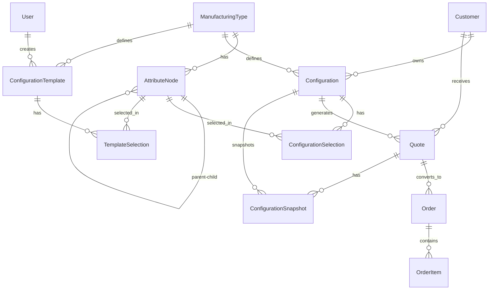

# Design Document: Windx Configurator Integration

ALAWAY RUN FROM `.venv` -> `.venv\scripts\python` not `python`

## Overview

This document describes the technical design for integrating the Windx automated window & door configurator system into the existing FastAPI backend application. The integration adds a complete product configuration subsystem while maintaining existing architectural patterns.

### System Purpose

The Windx system is an automated window & door configurator that enables:
- **Customer Empowerment**: Self-service product configuration with full transparency
- **Dynamic Hierarchical Attributes**: Type → Options → Sub-options → Sub-sub-options (unlimited depth)
- **Automated Pricing**: Real-time price calculation based on selections
- **Template System**: Pre-defined configurations for common use cases
- **Quote Generation**: Price snapshots with validity periods
- **Order Processing**: Full order lifecycle management

### Business Context

**Business Drivers:**
- Customer autonomy in product selection
- Operational efficiency through automation
- Scalability to new product lines and markets
- Reduced sales cycle time

**Business Objectives:**
- Enhance customer satisfaction through clarity and personalization
- Reduce manual overhead and errors
- Improve profit margins
- Enable strategic growth

### Design Principles

1. **Maintain Existing Architecture**: Follow repository pattern, service layer, SQLAlchemy 2.0, Pydantic V2
2. **Hybrid Database Approach**: Relational structure + LTREE for hierarchies + JSONB for flexibility
3. **Type Safety**: Full type hints, Pydantic validation, SQLAlchemy Mapped columns
4. **Pragmatic Performance**: Essential indexes only, optimize for current scale (800 users)
5. **Testability**: Clear separation of concerns, dependency injection
6. **No Over-Engineering**: Build for current needs, not hypothetical future scale
7. **Documentation First**: Understand the system before coding

## Documentation Requirements (Phase 0 - PRIORITY)

Before any code implementation, comprehensive documentation must be created to ensure full understanding of the system:

### 1. Global README.md Update
- Add Windx system overview
- Explain business purpose and objectives
- Document key features and capabilities
- Provide architecture overview
- Link to detailed documentation

### 2. docs/windx-overview.md (NEW FILE)
- Complete system overview understandable without code
- Business drivers and objectives
- Hierarchical attribute system explanation
- Type → Options → Sub-options concept
- Hybrid database approach (Relational + LTREE + JSONB)
- Pricing calculation system
- Template system workflow
- Quote and order workflow
- Diagrams and visual aids

### 3. docs/windx-sql-traits.md (NEW FILE)
- What is UNIQUE in our SQL design
- What is STANDARD SQL patterns
- LTREE usage and rationale
- JSONB usage for flexibility
- Trigger functions for automation
- Calculated fields approach
- Assessment: What is good
- Assessment: What could be better
- Assessment: What could be optimized
- Future steps and recommendations

### 4. docs/windx-sql-explanations.md (NEW FILE)
- High-level ERD explanation
- Each table's purpose and design rationale
- Why manufacturing_types table exists
- Why attribute_nodes uses LTREE
- Why configuration vs configuration_selections separation
- Template system tables design
- Quote snapshot approach
- Column purposes for key tables
- Data flow through the system
- Relationship diagrams

### 5. Full Integration Plan
- All SQLAlchemy models to create
- All repositories to implement
- All services to implement
- All API endpoints to create
- Testing strategy
- No migrations needed (fresh database)

## Architecture

### High-Level Architecture

```
┌─────────────────────────────────────────────────────────────┐
│                    API Layer (FastAPI)                       │
│  /api/v1/manufacturing-types, /attribute-nodes,             │
│  /configurations, /templates, /quotes, /orders              │
└──────────────────────┬──────────────────────────────────────┘
                       │
┌──────────────────────▼──────────────────────────────────────┐
│                    Service Layer                             │
│  ConfigurationService, TemplateService, QuoteService,       │
│  OrderService, PricingService, HierarchyService             │
└──────────────────────┬──────────────────────────────────────┘
                       │
┌──────────────────────▼──────────────────────────────────────┐
│                  Repository Layer                            │
│  ManufacturingTypeRepo, AttributeNodeRepo,                  │
│  ConfigurationRepo, TemplateRepo, QuoteRepo, OrderRepo      │
└──────────────────────┬──────────────────────────────────────┘
                       │
┌──────────────────────▼──────────────────────────────────────┐
│              Database Layer (PostgreSQL)                     │
│  Tables: manufacturing_types, attribute_nodes,              │
│  configurations, templates, quotes, orders                   │
│  Extensions: LTREE for hierarchies                          │
│  Features: Triggers, Functions, JSONB, GiST indexes         │
└─────────────────────────────────────────────────────────────┘
```

### Domain Model Overview

The Windx system consists of 8 core domain areas:

1. **Manufacturing Types**: Product categories (Window, Door, Table)
2. **Attribute Nodes**: Hierarchical attribute trees with pricing/weight impacts
3. **Configurations**: Customer-specific product designs
4. **Configuration Selections**: Individual attribute choices within configurations
5. **Templates**: Pre-defined common configurations
6. **Customers**: Customer management (extends existing user system)
7. **Quotes**: Price quotes with snapshots
8. **Orders**: Order processing and fulfillment


## Components and Interfaces

### 1. Database Models (SQLAlchemy 2.0)

#### ManufacturingType Model

```python
# app/models/manufacturing_type.py
class ManufacturingType(Base):
    """Product category model (Window, Door, Table)."""
    
    __tablename__ = "manufacturing_types"
    
    id: Mapped[int] = mapped_column(primary_key=True, index=True)
    name: Mapped[str] = mapped_column(String(100), unique=True, nullable=False)
    description: Mapped[str | None] = mapped_column(Text)
    base_category: Mapped[str | None] = mapped_column(String(50))
    image_url: Mapped[str | None] = mapped_column(String(255))
    base_price: Mapped[Decimal] = mapped_column(Numeric(10, 2), default=0)
    base_weight: Mapped[Decimal] = mapped_column(Numeric(10, 2), default=0)
    is_active: Mapped[bool] = mapped_column(default=True)
    created_at: Mapped[datetime] = mapped_column(TIMESTAMP(timezone=True), server_default=func.now())
    updated_at: Mapped[datetime] = mapped_column(TIMESTAMP(timezone=True), server_default=func.now(), onupdate=func.now())
    
    # Relationships
    attribute_nodes: Mapped[list["AttributeNode"]] = relationship(back_populates="manufacturing_type")
    configurations: Mapped[list["Configuration"]] = relationship(back_populates="manufacturing_type")
```

#### AttributeNode Model (Hierarchical)

```python
# app/models/attribute_node.py
from sqlalchemy.dialects.postgresql import LTREE

class AttributeNode(Base):
    """Hierarchical attribute tree node with LTREE."""
    
    __tablename__ = "attribute_nodes"
    
    id: Mapped[int] = mapped_column(primary_key=True, index=True)
    manufacturing_type_id: Mapped[int | None] = mapped_column(ForeignKey("manufacturing_types.id", ondelete="CASCADE"))
    parent_node_id: Mapped[int | None] = mapped_column(ForeignKey("attribute_nodes.id", ondelete="CASCADE"))
    
    name: Mapped[str] = mapped_column(String(200), nullable=False)
    node_type: Mapped[str] = mapped_column(String(20), nullable=False)  # category, attribute, option, component, technical_spec
    data_type: Mapped[str | None] = mapped_column(String(20))  # string, number, boolean, formula, dimension, selection
    
    # Dynamic behavior
    display_condition: Mapped[dict | None] = mapped_column(JSONB)
    validation_rules: Mapped[dict | None] = mapped_column(JSONB)
    required: Mapped[bool] = mapped_column(default=False)
    
    # Pricing impacts
    price_impact_type: Mapped[str] = mapped_column(String(20), default="fixed")
    price_impact_value: Mapped[Decimal | None] = mapped_column(Numeric(10, 2))
    price_formula: Mapped[str | None] = mapped_column(Text)
    
    # Weight impacts
    weight_impact: Mapped[Decimal] = mapped_column(Numeric(10, 2), default=0)
    weight_formula: Mapped[str | None] = mapped_column(Text)
    
    # Technical properties
    technical_property_type: Mapped[str | None] = mapped_column(String(50))
    technical_impact_formula: Mapped[str | None] = mapped_column(Text)
    
    # Hierarchy (LTREE for fast queries)
    ltree_path: Mapped[str] = mapped_column(LTREE, nullable=False, index=True)  # GiST index
    depth: Mapped[int] = mapped_column(default=0)
    
    # UI configuration
    sort_order: Mapped[int] = mapped_column(default=0)
    ui_component: Mapped[str | None] = mapped_column(String(50))
    description: Mapped[str | None] = mapped_column(Text)
    help_text: Mapped[str | None] = mapped_column(Text)
    
    created_at: Mapped[datetime] = mapped_column(TIMESTAMP(timezone=True), server_default=func.now())
    updated_at: Mapped[datetime] = mapped_column(TIMESTAMP(timezone=True), server_default=func.now(), onupdate=func.now())
    
    # Relationships
    manufacturing_type: Mapped["ManufacturingType"] = relationship(back_populates="attribute_nodes")
    parent: Mapped["AttributeNode | None"] = relationship(remote_side=[id], back_populates="children")
    children: Mapped[list["AttributeNode"]] = relationship(back_populates="parent")
```

#### Configuration Model

```python
# app/models/configuration.py
class Configuration(Base):
    """Customer product configuration."""
    
    __tablename__ = "configurations"
    
    id: Mapped[int] = mapped_column(primary_key=True, index=True)
    manufacturing_type_id: Mapped[int] = mapped_column(ForeignKey("manufacturing_types.id"), nullable=False)
    customer_id: Mapped[int | None] = mapped_column(ForeignKey("customers.id"))
    
    name: Mapped[str] = mapped_column(String(200), nullable=False)
    description: Mapped[str | None] = mapped_column(Text)
    status: Mapped[str] = mapped_column(String(20), default="draft")  # draft, saved, quoted, ordered
    reference_code: Mapped[str | None] = mapped_column(String(100), unique=True)
    
    # Calculated properties
    base_price: Mapped[Decimal] = mapped_column(Numeric(12, 2), default=0)
    total_price: Mapped[Decimal] = mapped_column(Numeric(12, 2), default=0)
    calculated_weight: Mapped[Decimal] = mapped_column(Numeric(10, 2), default=0)
    calculated_technical_data: Mapped[dict] = mapped_column(JSONB, default={})
    
    created_at: Mapped[datetime] = mapped_column(TIMESTAMP(timezone=True), server_default=func.now())
    updated_at: Mapped[datetime] = mapped_column(TIMESTAMP(timezone=True), server_default=func.now(), onupdate=func.now())
    
    # Relationships
    manufacturing_type: Mapped["ManufacturingType"] = relationship(back_populates="configurations")
    customer: Mapped["Customer | None"] = relationship(back_populates="configurations")
    selections: Mapped[list["ConfigurationSelection"]] = relationship(back_populates="configuration", cascade="all, delete-orphan")
```


#### ConfigurationSelection Model

```python
# app/models/configuration_selection.py
class ConfigurationSelection(Base):
    """Individual attribute selection within a configuration."""
    
    __tablename__ = "configuration_selections"
    
    id: Mapped[int] = mapped_column(primary_key=True, index=True)
    configuration_id: Mapped[int] = mapped_column(ForeignKey("configurations.id", ondelete="CASCADE"), nullable=False)
    attribute_node_id: Mapped[int] = mapped_column(ForeignKey("attribute_nodes.id"), nullable=False)
    
    # Flexible value storage
    string_value: Mapped[str | None] = mapped_column(Text)
    numeric_value: Mapped[Decimal | None] = mapped_column(Numeric(15, 6))
    boolean_value: Mapped[bool | None] = mapped_column()
    json_value: Mapped[dict | None] = mapped_column(JSONB)
    
    # Calculated impacts
    calculated_price_impact: Mapped[Decimal | None] = mapped_column(Numeric(10, 2))
    calculated_weight_impact: Mapped[Decimal | None] = mapped_column(Numeric(10, 2))
    calculated_technical_impact: Mapped[dict | None] = mapped_column(JSONB)
    
    # Hierarchy context
    selection_path: Mapped[str] = mapped_column(LTREE, index=True)
    
    created_at: Mapped[datetime] = mapped_column(TIMESTAMP(timezone=True), server_default=func.now())
    
    # Relationships
    configuration: Mapped["Configuration"] = relationship(back_populates="selections")
    attribute_node: Mapped["AttributeNode"] = relationship()
    
    __table_args__ = (
        UniqueConstraint("configuration_id", "attribute_node_id", name="uq_config_attr"),
    )
```

#### Template Models

```python
# app/models/template.py
class ConfigurationTemplate(Base):
    """Pre-defined configuration template."""
    
    __tablename__ = "configuration_templates"
    
    id: Mapped[int] = mapped_column(primary_key=True, index=True)
    name: Mapped[str] = mapped_column(String(200), nullable=False)
    description: Mapped[str | None] = mapped_column(Text)
    manufacturing_type_id: Mapped[int] = mapped_column(ForeignKey("manufacturing_types.id"), nullable=False)
    
    template_type: Mapped[str] = mapped_column(String(50), default="standard")
    is_public: Mapped[bool] = mapped_column(default=True)
    usage_count: Mapped[int] = mapped_column(default=0)
    success_rate: Mapped[Decimal] = mapped_column(Numeric(5, 2), default=0)
    
    estimated_price: Mapped[Decimal] = mapped_column(Numeric(12, 2), default=0)
    estimated_weight: Mapped[Decimal] = mapped_column(Numeric(10, 2), default=0)
    
    created_by: Mapped[int | None] = mapped_column(ForeignKey("users.id"))
    is_active: Mapped[bool] = mapped_column(default=True)
    created_at: Mapped[datetime] = mapped_column(TIMESTAMP(timezone=True), server_default=func.now())
    updated_at: Mapped[datetime] = mapped_column(TIMESTAMP(timezone=True), server_default=func.now(), onupdate=func.now())
    
    # Relationships
    manufacturing_type: Mapped["ManufacturingType"] = relationship()
    selections: Mapped[list["TemplateSelection"]] = relationship(cascade="all, delete-orphan")
    creator: Mapped["User | None"] = relationship()

class TemplateSelection(Base):
    """Pre-selected attribute in a template."""
    
    __tablename__ = "template_selections"
    
    id: Mapped[int] = mapped_column(primary_key=True, index=True)
    template_id: Mapped[int] = mapped_column(ForeignKey("configuration_templates.id", ondelete="CASCADE"), nullable=False)
    attribute_node_id: Mapped[int] = mapped_column(ForeignKey("attribute_nodes.id"), nullable=False)
    
    string_value: Mapped[str | None] = mapped_column(Text)
    numeric_value: Mapped[Decimal | None] = mapped_column(Numeric(15, 6))
    boolean_value: Mapped[bool | None] = mapped_column()
    json_value: Mapped[dict | None] = mapped_column(JSONB)
    selection_path: Mapped[str] = mapped_column(LTREE, index=True)
    
    created_at: Mapped[datetime] = mapped_column(TIMESTAMP(timezone=True), server_default=func.now())
    
    # Relationships
    template: Mapped["ConfigurationTemplate"] = relationship(back_populates="selections")
    attribute_node: Mapped["AttributeNode"] = relationship()
```

#### Customer, Quote, and Order Models

```python
# app/models/customer.py
class Customer(Base):
    """Customer management."""
    
    __tablename__ = "customers"
    
    id: Mapped[int] = mapped_column(primary_key=True, index=True)
    company_name: Mapped[str | None] = mapped_column(String(200))
    contact_person: Mapped[str | None] = mapped_column(String(100))
    email: Mapped[str | None] = mapped_column(String(255), unique=True, index=True)
    phone: Mapped[str | None] = mapped_column(String(50))
    address: Mapped[dict | None] = mapped_column(JSONB)
    customer_type: Mapped[str | None] = mapped_column(String(50))
    tax_id: Mapped[str | None] = mapped_column(String(100))
    payment_terms: Mapped[str | None] = mapped_column(String(100))
    is_active: Mapped[bool] = mapped_column(default=True)
    notes: Mapped[str | None] = mapped_column(Text)
    created_at: Mapped[datetime] = mapped_column(TIMESTAMP(timezone=True), server_default=func.now())
    updated_at: Mapped[datetime] = mapped_column(TIMESTAMP(timezone=True), server_default=func.now(), onupdate=func.now())
    
    # Relationships
    configurations: Mapped[list["Configuration"]] = relationship(back_populates="customer")
    quotes: Mapped[list["Quote"]] = relationship(back_populates="customer")

# app/models/quote.py
class Quote(Base):
    """Price quote with snapshot."""
    
    __tablename__ = "quotes"
    
    id: Mapped[int] = mapped_column(primary_key=True, index=True)
    configuration_id: Mapped[int] = mapped_column(ForeignKey("configurations.id"), nullable=False)
    customer_id: Mapped[int | None] = mapped_column(ForeignKey("customers.id"))
    quote_number: Mapped[str] = mapped_column(String(100), unique=True, nullable=False, index=True)
    
    subtotal: Mapped[Decimal] = mapped_column(Numeric(12, 2), default=0)
    tax_rate: Mapped[Decimal] = mapped_column(Numeric(5, 2), default=0)
    tax_amount: Mapped[Decimal] = mapped_column(Numeric(12, 2), default=0)
    discount_amount: Mapped[Decimal] = mapped_column(Numeric(12, 2), default=0)
    total_amount: Mapped[Decimal] = mapped_column(Numeric(12, 2), default=0)
    technical_requirements: Mapped[dict | None] = mapped_column(JSONB)
    
    valid_until: Mapped[date | None] = mapped_column(Date)
    status: Mapped[str] = mapped_column(String(20), default="draft")
    created_at: Mapped[datetime] = mapped_column(TIMESTAMP(timezone=True), server_default=func.now())
    updated_at: Mapped[datetime] = mapped_column(TIMESTAMP(timezone=True), server_default=func.now(), onupdate=func.now())
    
    # Relationships
    configuration: Mapped["Configuration"] = relationship()
    customer: Mapped["Customer | None"] = relationship(back_populates="quotes")
    snapshots: Mapped[list["ConfigurationSnapshot"]] = relationship()

# app/models/order.py
class Order(Base):
    """Order processing."""
    
    __tablename__ = "orders"
    
    id: Mapped[int] = mapped_column(primary_key=True, index=True)
    quote_id: Mapped[int] = mapped_column(ForeignKey("quotes.id"), nullable=False)
    order_number: Mapped[str] = mapped_column(String(100), unique=True, nullable=False, index=True)
    
    order_date: Mapped[date] = mapped_column(Date, server_default=func.current_date())
    required_date: Mapped[date | None] = mapped_column(Date)
    status: Mapped[str] = mapped_column(String(20), default="confirmed")
    special_instructions: Mapped[str | None] = mapped_column(Text)
    installation_address: Mapped[dict | None] = mapped_column(JSONB)
    
    created_at: Mapped[datetime] = mapped_column(TIMESTAMP(timezone=True), server_default=func.now())
    updated_at: Mapped[datetime] = mapped_column(TIMESTAMP(timezone=True), server_default=func.now(), onupdate=func.now())
    
    # Relationships
    quote: Mapped["Quote"] = relationship()
    items: Mapped[list["OrderItem"]] = relationship(cascade="all, delete-orphan")
```


### 2. Pydantic Schemas

#### Manufacturing Type Schemas

```python
# app/schemas/manufacturing_type.py
class ManufacturingTypeBase(BaseModel):
    name: Annotated[str, Field(max_length=100, description="Product type name")]
    description: Annotated[str | None, Field(default=None, description="Detailed description")]
    base_category: Annotated[str | None, Field(default=None, max_length=50)]
    image_url: Annotated[str | None, Field(default=None, max_length=255)]
    base_price: Annotated[Decimal, Field(default=Decimal("0"), ge=0, decimal_places=2)]
    base_weight: Annotated[Decimal, Field(default=Decimal("0"), ge=0, decimal_places=2)]

class ManufacturingTypeCreate(ManufacturingTypeBase):
    pass

class ManufacturingTypeUpdate(BaseModel):
    name: Annotated[str | None, Field(default=None, max_length=100)]
    description: Annotated[str | None, Field(default=None)]
    base_price: Annotated[Decimal | None, Field(default=None, ge=0)]
    base_weight: Annotated[Decimal | None, Field(default=None, ge=0)]
    is_active: Annotated[bool | None, Field(default=None)]

class ManufacturingType(ManufacturingTypeBase):
    id: Annotated[PositiveInt, Field(description="Manufacturing type ID")]
    is_active: Annotated[bool, Field(description="Active status")]
    created_at: Annotated[datetime, Field(description="Creation timestamp")]
    updated_at: Annotated[datetime, Field(description="Last update timestamp")]
    
    model_config = ConfigDict(from_attributes=True)
```

#### Attribute Node Schemas

```python
# app/schemas/attribute_node.py
class DisplayCondition(BaseModel):
    """Conditional display logic."""
    operator: Annotated[str, Field(description="Operator: equals, contains, gt, lt, exists")]
    field: Annotated[str, Field(description="Field to check")]
    value: Annotated[Any, Field(description="Value to compare")]

class ValidationRule(BaseModel):
    """Validation rule definition."""
    rule_type: Annotated[str, Field(description="Type: required, min, max, pattern, custom")]
    value: Annotated[Any, Field(description="Rule value")]
    message: Annotated[str, Field(description="Error message")]

class AttributeNodeBase(BaseModel):
    name: Annotated[str, Field(max_length=200, description="Attribute name")]
    node_type: Annotated[str, Field(description="Node type: category, attribute, option, component, technical_spec")]
    data_type: Annotated[str | None, Field(default=None, description="Data type: string, number, boolean, formula, dimension, selection")]
    display_condition: Annotated[dict | None, Field(default=None)]
    validation_rules: Annotated[dict | None, Field(default=None)]
    required: Annotated[bool, Field(default=False)]
    price_impact_type: Annotated[str, Field(default="fixed", description="fixed, percentage, formula")]
    price_impact_value: Annotated[Decimal | None, Field(default=None, decimal_places=2)]
    price_formula: Annotated[str | None, Field(default=None)]
    weight_impact: Annotated[Decimal, Field(default=Decimal("0"), decimal_places=2)]
    weight_formula: Annotated[str | None, Field(default=None)]
    sort_order: Annotated[int, Field(default=0)]
    ui_component: Annotated[str | None, Field(default=None, max_length=50)]
    description: Annotated[str | None, Field(default=None)]
    help_text: Annotated[str | None, Field(default=None)]

class AttributeNodeCreate(AttributeNodeBase):
    manufacturing_type_id: Annotated[PositiveInt | None, Field(default=None)]
    parent_node_id: Annotated[PositiveInt | None, Field(default=None)]

class AttributeNode(AttributeNodeBase):
    id: Annotated[PositiveInt, Field(description="Attribute node ID")]
    manufacturing_type_id: Annotated[PositiveInt | None, Field(default=None)]
    parent_node_id: Annotated[PositiveInt | None, Field(default=None)]
    ltree_path: Annotated[str, Field(description="Hierarchical path")]
    depth: Annotated[int, Field(description="Nesting level")]
    created_at: Annotated[datetime, Field(description="Creation timestamp")]
    updated_at: Annotated[datetime, Field(description="Last update timestamp")]
    
    model_config = ConfigDict(from_attributes=True)

class AttributeNodeTree(AttributeNode):
    """Attribute node with children for tree representation."""
    children: Annotated[list["AttributeNodeTree"], Field(default_factory=list)]
```

#### Configuration Schemas

```python
# app/schemas/configuration.py
class ConfigurationSelectionValue(BaseModel):
    """Flexible value container for selections."""
    attribute_node_id: Annotated[PositiveInt, Field(description="Attribute node ID")]
    string_value: Annotated[str | None, Field(default=None)]
    numeric_value: Annotated[Decimal | None, Field(default=None)]
    boolean_value: Annotated[bool | None, Field(default=None)]
    json_value: Annotated[dict | None, Field(default=None)]

class ConfigurationBase(BaseModel):
    name: Annotated[str, Field(max_length=200, description="Configuration name")]
    description: Annotated[str | None, Field(default=None)]

class ConfigurationCreate(ConfigurationBase):
    manufacturing_type_id: Annotated[PositiveInt, Field(description="Manufacturing type ID")]
    customer_id: Annotated[PositiveInt | None, Field(default=None)]
    selections: Annotated[list[ConfigurationSelectionValue], Field(default_factory=list)]

class ConfigurationUpdate(BaseModel):
    name: Annotated[str | None, Field(default=None, max_length=200)]
    description: Annotated[str | None, Field(default=None)]
    status: Annotated[str | None, Field(default=None)]
    selections: Annotated[list[ConfigurationSelectionValue] | None, Field(default=None)]

class Configuration(ConfigurationBase):
    id: Annotated[PositiveInt, Field(description="Configuration ID")]
    manufacturing_type_id: Annotated[PositiveInt, Field(description="Manufacturing type ID")]
    customer_id: Annotated[PositiveInt | None, Field(default=None)]
    status: Annotated[str, Field(description="Status: draft, saved, quoted, ordered")]
    reference_code: Annotated[str | None, Field(default=None)]
    base_price: Annotated[Decimal, Field(description="Base price")]
    total_price: Annotated[Decimal, Field(description="Total calculated price")]
    calculated_weight: Annotated[Decimal, Field(description="Total weight")]
    calculated_technical_data: Annotated[dict, Field(description="Technical specifications")]
    created_at: Annotated[datetime, Field(description="Creation timestamp")]
    updated_at: Annotated[datetime, Field(description="Last update timestamp")]
    
    model_config = ConfigDict(from_attributes=True)

class ConfigurationWithSelections(Configuration):
    """Configuration with full selection details."""
    selections: Annotated[list["ConfigurationSelection"], Field(default_factory=list)]
```


### 3. Repository Layer

#### Base Repository Extensions

```python
# app/repositories/windx_base.py
class HierarchicalRepository(BaseRepository[ModelType, CreateSchemaType, UpdateSchemaType]):
    """Extended repository for hierarchical data with LTREE support."""
    
    async def get_descendants(self, node_id: int) -> list[ModelType]:
        """Get all descendants of a node using LTREE."""
        node = await self.get(node_id)
        if not node:
            return []
        
        # Use LTREE @> operator for descendants
        result = await self.db.execute(
            select(self.model).where(
                self.model.ltree_path.descendant_of(node.ltree_path)
            ).order_by(self.model.ltree_path)
        )
        return list(result.scalars().all())
    
    async def get_ancestors(self, node_id: int) -> list[ModelType]:
        """Get all ancestors of a node using LTREE."""
        node = await self.get(node_id)
        if not node:
            return []
        
        # Use LTREE <@ operator for ancestors
        result = await self.db.execute(
            select(self.model).where(
                self.model.ltree_path.ancestor_of(node.ltree_path)
            ).order_by(self.model.ltree_path)
        )
        return list(result.scalars().all())
    
    async def get_children(self, node_id: int | None) -> list[ModelType]:
        """Get direct children of a node."""
        result = await self.db.execute(
            select(self.model).where(
                self.model.parent_node_id == node_id
            ).order_by(self.model.sort_order, self.model.name)
        )
        return list(result.scalars().all())
    
    async def get_tree(self, root_id: int | None = None) -> list[ModelType]:
        """Get entire tree structure."""
        if root_id:
            return await self.get_descendants(root_id)
        
        result = await self.db.execute(
            select(self.model).order_by(self.model.ltree_path)
        )
        return list(result.scalars().all())
```

#### Specific Repositories

```python
# app/repositories/manufacturing_type.py
class ManufacturingTypeRepository(BaseRepository[ManufacturingType, ManufacturingTypeCreate, ManufacturingTypeUpdate]):
    """Repository for manufacturing types."""
    
    def __init__(self, db: AsyncSession):
        super().__init__(ManufacturingType, db)
    
    async def get_by_name(self, name: str) -> ManufacturingType | None:
        """Get manufacturing type by name."""
        result = await self.db.execute(
            select(ManufacturingType).where(ManufacturingType.name == name)
        )
        return result.scalar_one_or_none()
    
    async def get_active(self) -> list[ManufacturingType]:
        """Get all active manufacturing types."""
        result = await self.db.execute(
            select(ManufacturingType)
            .where(ManufacturingType.is_active == True)
            .order_by(ManufacturingType.name)
        )
        return list(result.scalars().all())
    
    async def get_by_category(self, category: str) -> list[ManufacturingType]:
        """Get manufacturing types by base category."""
        result = await self.db.execute(
            select(ManufacturingType)
            .where(ManufacturingType.base_category == category)
            .order_by(ManufacturingType.name)
        )
        return list(result.scalars().all())

# app/repositories/attribute_node.py
class AttributeNodeRepository(HierarchicalRepository[AttributeNode, AttributeNodeCreate, AttributeNodeUpdate]):
    """Repository for attribute nodes with hierarchy support."""
    
    def __init__(self, db: AsyncSession):
        super().__init__(AttributeNode, db)
    
    async def get_by_manufacturing_type(self, manufacturing_type_id: int) -> list[AttributeNode]:
        """Get all attribute nodes for a manufacturing type."""
        result = await self.db.execute(
            select(AttributeNode)
            .where(AttributeNode.manufacturing_type_id == manufacturing_type_id)
            .order_by(AttributeNode.ltree_path)
        )
        return list(result.scalars().all())
    
    async def get_root_nodes(self, manufacturing_type_id: int) -> list[AttributeNode]:
        """Get root nodes (no parent) for a manufacturing type."""
        result = await self.db.execute(
            select(AttributeNode)
            .where(
                AttributeNode.manufacturing_type_id == manufacturing_type_id,
                AttributeNode.parent_node_id == None
            )
            .order_by(AttributeNode.sort_order, AttributeNode.name)
        )
        return list(result.scalars().all())
    
    async def search_by_path_pattern(self, pattern: str) -> list[AttributeNode]:
        """Search nodes by LTREE path pattern."""
        result = await self.db.execute(
            select(AttributeNode).where(
                AttributeNode.ltree_path.lquery(pattern)
            )
        )
        return list(result.scalars().all())

# app/repositories/configuration.py
class ConfigurationRepository(BaseRepository[Configuration, ConfigurationCreate, ConfigurationUpdate]):
    """Repository for configurations."""
    
    def __init__(self, db: AsyncSession):
        super().__init__(Configuration, db)
    
    async def get_by_customer(self, customer_id: int, status: str | None = None) -> list[Configuration]:
        """Get configurations for a customer, optionally filtered by status."""
        query = select(Configuration).where(Configuration.customer_id == customer_id)
        if status:
            query = query.where(Configuration.status == status)
        query = query.order_by(Configuration.updated_at.desc())
        
        result = await self.db.execute(query)
        return list(result.scalars().all())
    
    async def get_by_reference_code(self, reference_code: str) -> Configuration | None:
        """Get configuration by reference code."""
        result = await self.db.execute(
            select(Configuration).where(Configuration.reference_code == reference_code)
        )
        return result.scalar_one_or_none()
    
    async def get_with_selections(self, config_id: int) -> Configuration | None:
        """Get configuration with all selections eagerly loaded."""
        result = await self.db.execute(
            select(Configuration)
            .options(selectinload(Configuration.selections))
            .where(Configuration.id == config_id)
        )
        return result.scalar_one_or_none()

# app/repositories/template.py
class TemplateRepository(BaseRepository[ConfigurationTemplate, TemplateCreate, TemplateUpdate]):
    """Repository for configuration templates."""
    
    def __init__(self, db: AsyncSession):
        super().__init__(ConfigurationTemplate, db)
    
    async def get_public_templates(self, manufacturing_type_id: int | None = None) -> list[ConfigurationTemplate]:
        """Get public templates, optionally filtered by manufacturing type."""
        query = select(ConfigurationTemplate).where(
            ConfigurationTemplate.is_public == True,
            ConfigurationTemplate.is_active == True
        )
        if manufacturing_type_id:
            query = query.where(ConfigurationTemplate.manufacturing_type_id == manufacturing_type_id)
        query = query.order_by(ConfigurationTemplate.usage_count.desc())
        
        result = await self.db.execute(query)
        return list(result.scalars().all())
    
    async def get_with_selections(self, template_id: int) -> ConfigurationTemplate | None:
        """Get template with selections eagerly loaded."""
        result = await self.db.execute(
            select(ConfigurationTemplate)
            .options(selectinload(ConfigurationTemplate.selections))
            .where(ConfigurationTemplate.id == template_id)
        )
        return result.scalar_one_or_none()
```


### 4. Service Layer

#### Configuration Service

```python
# app/services/configuration.py
class ConfigurationService(BaseService):
    """Business logic for configuration management."""
    
    def __init__(self, db: AsyncSession):
        super().__init__(db)
        self.config_repo = ConfigurationRepository(db)
        self.selection_repo = ConfigurationSelectionRepository(db)
        self.attr_repo = AttributeNodeRepository(db)
        self.mfg_repo = ManufacturingTypeRepository(db)
    
    async def create_configuration(
        self, 
        config_in: ConfigurationCreate,
        customer_id: int | None = None
    ) -> Configuration:
        """Create new configuration with selections."""
        # Validate manufacturing type exists
        mfg_type = await self.mfg_repo.get(config_in.manufacturing_type_id)
        if not mfg_type:
            raise NotFoundException(resource="ManufacturingType")
        
        # Create configuration
        config_data = config_in.model_dump(exclude={"selections"})
        config_data["customer_id"] = customer_id
        config_data["base_price"] = mfg_type.base_price
        config_data["reference_code"] = self._generate_reference_code()
        
        config = Configuration(**config_data)
        self.db.add(config)
        await self.db.flush()  # Get ID without committing
        
        # Add selections
        if config_in.selections:
            await self._add_selections(config.id, config_in.selections)
        
        # Calculate totals
        await self._recalculate_configuration(config.id)
        
        await self.commit()
        await self.refresh(config)
        return config
    
    async def update_selections(
        self,
        config_id: int,
        selections: list[ConfigurationSelectionValue]
    ) -> Configuration:
        """Update configuration selections and recalculate."""
        config = await self.config_repo.get(config_id)
        if not config:
            raise NotFoundException(resource="Configuration")
        
        # Delete existing selections
        await self.db.execute(
            delete(ConfigurationSelection).where(
                ConfigurationSelection.configuration_id == config_id
            )
        )
        
        # Add new selections
        await self._add_selections(config_id, selections)
        
        # Recalculate
        await self._recalculate_configuration(config_id)
        
        await self.commit()
        await self.refresh(config)
        return config
    
    async def _add_selections(
        self,
        config_id: int,
        selections: list[ConfigurationSelectionValue]
    ) -> None:
        """Add selections to configuration."""
        for sel in selections:
            # Validate attribute node exists
            attr_node = await self.attr_repo.get(sel.attribute_node_id)
            if not attr_node:
                continue
            
            selection = ConfigurationSelection(
                configuration_id=config_id,
                attribute_node_id=sel.attribute_node_id,
                string_value=sel.string_value,
                numeric_value=sel.numeric_value,
                boolean_value=sel.boolean_value,
                json_value=sel.json_value,
                selection_path=attr_node.ltree_path,
                calculated_price_impact=attr_node.price_impact_value,
                calculated_weight_impact=attr_node.weight_impact
            )
            self.db.add(selection)
    
    async def _recalculate_configuration(self, config_id: int) -> None:
        """Recalculate configuration totals."""
        # Get configuration with selections
        config = await self.config_repo.get_with_selections(config_id)
        if not config:
            return
        
        # Calculate price
        total_price = config.base_price
        total_weight = Decimal("0")
        
        for selection in config.selections:
            if selection.calculated_price_impact:
                total_price += selection.calculated_price_impact
            if selection.calculated_weight_impact:
                total_weight += selection.calculated_weight_impact
        
        # Update configuration
        config.total_price = total_price
        config.calculated_weight = total_weight
        config.updated_at = datetime.now(UTC)
    
    def _generate_reference_code(self) -> str:
        """Generate unique reference code."""
        import uuid
        return f"CFG-{uuid.uuid4().hex[:8].upper()}"
```

#### Template Service

```python
# app/services/template.py
class TemplateService(BaseService):
    """Business logic for template management."""
    
    def __init__(self, db: AsyncSession):
        super().__init__(db)
        self.template_repo = TemplateRepository(db)
        self.config_service = ConfigurationService(db)
    
    async def create_from_configuration(
        self,
        config_id: int,
        template_name: str,
        template_type: str = "standard",
        is_public: bool = True,
        created_by: int | None = None
    ) -> ConfigurationTemplate:
        """Create template from existing configuration."""
        # Get configuration with selections
        config = await self.config_service.config_repo.get_with_selections(config_id)
        if not config:
            raise NotFoundException(resource="Configuration")
        
        # Create template
        template = ConfigurationTemplate(
            name=template_name,
            description=config.description,
            manufacturing_type_id=config.manufacturing_type_id,
            template_type=template_type,
            is_public=is_public,
            estimated_price=config.total_price,
            estimated_weight=config.calculated_weight,
            created_by=created_by
        )
        self.db.add(template)
        await self.db.flush()
        
        # Copy selections
        for sel in config.selections:
            template_sel = TemplateSelection(
                template_id=template.id,
                attribute_node_id=sel.attribute_node_id,
                string_value=sel.string_value,
                numeric_value=sel.numeric_value,
                boolean_value=sel.boolean_value,
                json_value=sel.json_value,
                selection_path=sel.selection_path
            )
            self.db.add(template_sel)
        
        await self.commit()
        await self.refresh(template)
        return template
    
    async def apply_template(
        self,
        template_id: int,
        customer_id: int | None = None,
        config_name: str | None = None
    ) -> Configuration:
        """Create configuration from template."""
        # Get template with selections
        template = await self.template_repo.get_with_selections(template_id)
        if not template or not template.is_active:
            raise NotFoundException(resource="Template")
        
        # Create configuration
        config_create = ConfigurationCreate(
            name=config_name or f"{template.name} - {datetime.now().strftime('%Y-%m-%d')}",
            description=template.description,
            manufacturing_type_id=template.manufacturing_type_id,
            selections=[
                ConfigurationSelectionValue(
                    attribute_node_id=sel.attribute_node_id,
                    string_value=sel.string_value,
                    numeric_value=sel.numeric_value,
                    boolean_value=sel.boolean_value,
                    json_value=sel.json_value
                )
                for sel in template.selections
            ]
        )
        
        config = await self.config_service.create_configuration(config_create, customer_id)
        
        # Update template usage
        template.usage_count += 1
        await self.commit()
        
        return config
```

#### Quote Service

```python
# app/services/quote.py
class QuoteService(BaseService):
    """Business logic for quote generation."""
    
    def __init__(self, db: AsyncSession):
        super().__init__(db)
        self.quote_repo = QuoteRepository(db)
        self.config_repo = ConfigurationRepository(db)
        self.snapshot_repo = ConfigurationSnapshotRepository(db)
    
    async def create_quote(
        self,
        config_id: int,
        customer_id: int | None = None,
        valid_days: int = 30,
        tax_rate: Decimal = Decimal("0"),
        discount_amount: Decimal = Decimal("0")
    ) -> Quote:
        """Create quote with price snapshot."""
        # Get configuration
        config = await self.config_repo.get_with_selections(config_id)
        if not config:
            raise NotFoundException(resource="Configuration")
        
        # Calculate amounts
        subtotal = config.total_price
        tax_amount = subtotal * (tax_rate / 100)
        total_amount = subtotal + tax_amount - discount_amount
        
        # Create quote
        quote = Quote(
            configuration_id=config_id,
            customer_id=customer_id,
            quote_number=self._generate_quote_number(),
            subtotal=subtotal,
            tax_rate=tax_rate,
            tax_amount=tax_amount,
            discount_amount=discount_amount,
            total_amount=total_amount,
            valid_until=date.today() + timedelta(days=valid_days),
            status="draft"
        )
        self.db.add(quote)
        await self.db.flush()
        
        # Create snapshot
        await self._create_snapshot(quote.id, config)
        
        # Update configuration status
        config.status = "quoted"
        
        await self.commit()
        await self.refresh(quote)
        return quote
    
    async def _create_snapshot(self, quote_id: int, config: Configuration) -> None:
        """Create configuration snapshot for quote."""
        # Build price breakdown
        price_breakdown = {
            "base": float(config.base_price),
            "options": float(config.total_price - config.base_price),
            "selections": [
                {
                    "attribute_node_id": sel.attribute_node_id,
                    "impact": float(sel.calculated_price_impact or 0)
                }
                for sel in config.selections
            ]
        }
        
        snapshot = ConfigurationSnapshot(
            configuration_id=config.id,
            quote_id=quote_id,
            base_price=config.base_price,
            total_price=config.total_price,
            calculated_weight=config.calculated_weight,
            price_breakdown=price_breakdown,
            weight_breakdown={},
            technical_snapshot=config.calculated_technical_data,
            snapshot_type="price_quote",
            snapshot_reason="Quote generation"
        )
        self.db.add(snapshot)
    
    def _generate_quote_number(self) -> str:
        """Generate unique quote number."""
        import time
        return f"Q-{int(time.time())}"
```


## Data Models

### Entity Relationship Diagram



### Key Design Decisions

#### 1. Hybrid Hierarchical Approach (Adjacency + LTREE)

**Decision**: Use both `parent_node_id` (adjacency list) and `ltree_path` (materialized path) for attribute hierarchies.

**Rationale**:
- Adjacency list provides intuitive parent-child relationships
- LTREE enables fast ancestor/descendant queries without recursion
- Database triggers maintain LTREE paths automatically
- Best of both worlds: easy writes, fast reads

**Trade-offs**:
- Slightly more complex schema
- Requires PostgreSQL-specific LTREE extension
- Path updates cascade to descendants (handled by triggers)

#### 2. Flexible Value Storage (Multi-Column)

**Decision**: Store selection values in separate typed columns (`string_value`, `numeric_value`, `boolean_value`, `json_value`) rather than single TEXT column.

**Rationale**:
- Enables proper indexing on numeric/boolean values
- Allows database-level type validation
- Supports efficient filtering and aggregation
- JSONB column handles complex structured data

**Trade-offs**:
- Multiple nullable columns instead of single column
- Application must determine which column to use based on data_type

#### 3. Calculated Fields in Configuration

**Decision**: Store calculated totals (`total_price`, `calculated_weight`) directly in configuration table, updated via triggers.

**Rationale**:
- Fast reads for common queries (no aggregation needed)
- Enables efficient sorting and filtering by price/weight
- Snapshots preserve historical calculations
- Triggers ensure consistency

**Trade-offs**:
- Data duplication (calculated from selections)
- Requires trigger maintenance
- Must handle trigger failures gracefully

#### 4. Template System Separate from Configurations

**Decision**: Create separate `configuration_templates` and `template_selections` tables rather than flagging configurations as templates.

**Rationale**:
- Clear separation of concerns
- Templates have different lifecycle (usage tracking, metrics)
- Templates don't need customer association
- Easier to manage permissions (public vs private)

**Trade-offs**:
- More tables to maintain
- Duplication when creating template from configuration

#### 5. Quote Snapshots for Price Locking

**Decision**: Create immutable snapshots when generating quotes to lock prices.

**Rationale**:
- Prices can change over time (attribute updates, base price changes)
- Quotes must honor original pricing
- Audit trail for pricing decisions
- Supports historical analysis

**Trade-offs**:
- Storage overhead for snapshots
- Complexity in snapshot creation logic


## Error Handling

### Domain Exceptions

```python
# app/core/exceptions.py (additions)

class ConfigurationException(AppException):
    """Base exception for configuration errors."""
    def __init__(self, message: str, details: dict | None = None):
        super().__init__(
            status_code=400,
            error_code="configuration_error",
            message=message,
            details=details or {}
        )

class InvalidSelectionException(ConfigurationException):
    """Raised when attribute selection is invalid."""
    def __init__(self, attribute_id: int, reason: str):
        super().__init__(
            message=f"Invalid selection for attribute {attribute_id}",
            details={"attribute_id": attribute_id, "reason": reason}
        )

class HierarchyException(AppException):
    """Raised when hierarchy operations fail."""
    def __init__(self, message: str, details: dict | None = None):
        super().__init__(
            status_code=400,
            error_code="hierarchy_error",
            message=message,
            details=details or {}
        )

class PricingException(AppException):
    """Raised when pricing calculation fails."""
    def __init__(self, message: str, details: dict | None = None):
        super().__init__(
            status_code=500,
            error_code="pricing_error",
            message=message,
            details=details or {}
        )
```

### Validation Strategy

1. **Schema Validation**: Pydantic validates request data structure
2. **Business Rule Validation**: Services validate business logic
3. **Database Constraints**: PostgreSQL enforces referential integrity
4. **Trigger Validation**: Database triggers validate hierarchy consistency

## Testing Strategy

### Unit Tests

```python
# tests/unit/services/test_configuration_service.py
async def test_create_configuration_calculates_price():
    """Test that configuration creation calculates total price."""
    mock_db = AsyncMock()
    service = ConfigurationService(mock_db)
    
    # Mock repositories
    service.mfg_repo.get = AsyncMock(return_value=ManufacturingType(
        id=1, base_price=Decimal("100.00")
    ))
    
    config_in = ConfigurationCreate(
        name="Test Config",
        manufacturing_type_id=1,
        selections=[
            ConfigurationSelectionValue(
                attribute_node_id=1,
                numeric_value=Decimal("50.00")
            )
        ]
    )
    
    config = await service.create_configuration(config_in)
    
    assert config.total_price == Decimal("150.00")

# tests/unit/repositories/test_attribute_node_repository.py
async def test_get_descendants_returns_all_children(db_session):
    """Test LTREE descendant query."""
    repo = AttributeNodeRepository(db_session)
    
    # Create hierarchy
    root = AttributeNode(name="Root", ltree_path="root", depth=0)
    child1 = AttributeNode(name="Child1", ltree_path="root.child1", depth=1)
    child2 = AttributeNode(name="Child2", ltree_path="root.child1.child2", depth=2)
    
    db_session.add_all([root, child1, child2])
    await db_session.commit()
    
    descendants = await repo.get_descendants(root.id)
    
    assert len(descendants) == 2
    assert child1 in descendants
    assert child2 in descendants
```

### Integration Tests

```python
# tests/integration/test_configuration_flow.py
async def test_full_configuration_to_quote_flow(client: AsyncClient, test_user):
    """Test complete flow from configuration to quote."""
    # Create manufacturing type
    mfg_response = await client.post(
        "/api/v1/manufacturing-types",
        json={"name": "Window", "base_price": "100.00"},
        headers={"Authorization": f"Bearer {test_user.token}"}
    )
    assert mfg_response.status_code == 201
    mfg_id = mfg_response.json()["id"]
    
    # Create configuration
    config_response = await client.post(
        "/api/v1/configurations",
        json={
            "name": "My Window",
            "manufacturing_type_id": mfg_id,
            "selections": []
        },
        headers={"Authorization": f"Bearer {test_user.token}"}
    )
    assert config_response.status_code == 201
    config_id = config_response.json()["id"]
    
    # Generate quote
    quote_response = await client.post(
        f"/api/v1/configurations/{config_id}/quote",
        json={"valid_days": 30},
        headers={"Authorization": f"Bearer {test_user.token}"}
    )
    assert quote_response.status_code == 201
    assert "quote_number" in quote_response.json()
```

### Test Data Factories (Simple)

```python
# tests/factories/windx_factories.py
class ManufacturingTypeFactory:
    """Factory for creating test manufacturing types."""
    
    @staticmethod
    def create(name: str = "Test Window", **kwargs) -> ManufacturingType:
        return ManufacturingType(
            name=name,
            base_price=Decimal("100.00"),
            base_weight=Decimal("10.00"),
            is_active=True,
            **kwargs
        )
```

**Note**: Start with simple factories. Add more complex ones only when tests require them.


## Performance Considerations

### Essential Database Indexes

```sql
-- LTREE indexes (GiST for hierarchy queries) - REQUIRED
CREATE INDEX idx_attribute_nodes_ltree ON attribute_nodes USING GIST (ltree_path);

-- Foreign key indexes - REQUIRED for joins
CREATE INDEX idx_attribute_nodes_manufacturing_type ON attribute_nodes(manufacturing_type_id);
CREATE INDEX idx_configurations_type ON configurations(manufacturing_type_id);
CREATE INDEX idx_configurations_customer ON configurations(customer_id);

-- Lookup indexes - REQUIRED for common queries
CREATE INDEX idx_configurations_reference ON configurations(reference_code);
CREATE INDEX idx_quotes_number ON quotes(quote_number);
CREATE INDEX idx_orders_number ON orders(order_number);
```

**Note**: Start with these essential indexes. Add more only if performance issues arise.

### Simple Optimization Strategies

1. **Use `selectinload()` for relationships** - Prevents N+1 queries
2. **Paginate list endpoints** - Use existing pagination helper
3. **Calculate in database** - Use database aggregation for totals
4. **Cache sparingly** - Only cache manufacturing types and attribute trees (rarely change)

### Caching Strategy (Minimal)

```python
# Cache manufacturing types (rarely change, read-heavy)
@cache(expire=3600)  # 1 hour
async def get_manufacturing_types():
    pass

# Cache attribute trees (rarely change, read-heavy)
@cache(expire=1800)  # 30 minutes
async def get_attribute_tree(manufacturing_type_id: int):
    pass

# NO caching for configurations, quotes, orders (user-specific, frequently updated)
```

### Expected Performance (800 users)

- **Manufacturing Type List**: < 100ms
- **Attribute Tree Load**: < 200ms for 50-node tree
- **Configuration Create**: < 300ms with 10 selections
- **Configuration List**: < 200ms (paginated)
- **Quote Generation**: < 500ms including snapshot

**Note**: These targets are sufficient for 800 users. Optimize further only if needed.

## Security

### Authorization Rules

```python
# app/api/deps.py (additions)

async def get_configuration_owner(
    config_id: int,
    current_user: CurrentUser,
    db: DBSession
) -> Configuration:
    """Verify user owns configuration or is superuser."""
    config_repo = ConfigurationRepository(db)
    config = await config_repo.get(config_id)
    
    if not config:
        raise NotFoundException(resource="Configuration")
    
    if not current_user.is_superuser and config.customer_id != current_user.id:
        raise AuthorizationException(message="Not authorized to access this configuration")
    
    return config
```

### Endpoint Protection

- **Manufacturing Types**: Read (all), Write (superuser only)
- **Attribute Nodes**: Read (all), Write (superuser only)
- **Configurations**: Read (owner or superuser), Write (owner or superuser)
- **Templates**: Read (public or creator), Write (creator or superuser)
- **Quotes**: Read (customer or superuser), Write (customer or superuser)
- **Orders**: Read (customer or superuser), Write (customer or superuser)

### Data Validation

1. **Input Validation**: Pydantic schemas validate all inputs
2. **Business Rules**: Services enforce business logic
3. **SQL Injection**: SQLAlchemy ORM prevents SQL injection
4. **XSS Prevention**: API returns JSON (no HTML rendering)
5. **CSRF Protection**: Token-based auth (no cookies)

## Implementation Strategy

### Phase 1: Database Setup

1. Enable LTREE extension
2. Create all SQLAlchemy models with table definitions
3. Create indexes in model definitions
4. Create triggers and functions via SQL scripts
5. Verify with test data

### Phase 2: Models and Repositories

1. Create SQLAlchemy models
2. Create Pydantic schemas
3. Create repositories
4. Write repository tests

### Phase 3: Services

1. Create service classes
2. Implement business logic
3. Write service tests

### Phase 4: API Endpoints

1. Create endpoint modules
2. Add OpenAPI documentation
3. Write integration tests

### Phase 5: Testing and Optimization

1. Run full test suite
2. Performance testing
3. Add caching
4. Optimize queries

### Deployment Notes

- Fresh database setup (no existing tables to migrate)
- Schema created via SQLAlchemy Base.metadata.create_all()
- No data loss concerns for existing user system
- Can deploy incrementally (tables first, then code)


## API Endpoints Design

### Manufacturing Types

```
GET    /api/v1/manufacturing-types          # List all types
GET    /api/v1/manufacturing-types/{id}     # Get single type
POST   /api/v1/manufacturing-types          # Create type (superuser)
PATCH  /api/v1/manufacturing-types/{id}     # Update type (superuser)
DELETE /api/v1/manufacturing-types/{id}     # Delete type (superuser)
GET    /api/v1/manufacturing-types/{id}/attributes  # Get attribute tree
```

### Attribute Nodes

```
GET    /api/v1/attribute-nodes                    # List nodes (with filters)
GET    /api/v1/attribute-nodes/{id}               # Get single node
POST   /api/v1/attribute-nodes                    # Create node (superuser)
PATCH  /api/v1/attribute-nodes/{id}               # Update node (superuser)
DELETE /api/v1/attribute-nodes/{id}               # Delete node (superuser)
GET    /api/v1/attribute-nodes/{id}/descendants   # Get descendants
GET    /api/v1/attribute-nodes/{id}/ancestors     # Get ancestors
GET    /api/v1/attribute-nodes/{id}/children      # Get direct children
```

### Configurations

```
GET    /api/v1/configurations                     # List user's configurations
GET    /api/v1/configurations/{id}                # Get configuration
POST   /api/v1/configurations                     # Create configuration
PATCH  /api/v1/configurations/{id}                # Update configuration
DELETE /api/v1/configurations/{id}                # Delete configuration
PUT    /api/v1/configurations/{id}/selections     # Update selections
POST   /api/v1/configurations/{id}/quote          # Generate quote
GET    /api/v1/configurations/{id}/calculate      # Recalculate totals
```

### Templates

```
GET    /api/v1/templates                          # List public templates
GET    /api/v1/templates/{id}                     # Get template
POST   /api/v1/templates                          # Create template
PATCH  /api/v1/templates/{id}                     # Update template
DELETE /api/v1/templates/{id}                     # Delete template
POST   /api/v1/templates/{id}/apply               # Apply template (create config)
GET    /api/v1/templates/{id}/metrics             # Get usage metrics
```

### Quotes

```
GET    /api/v1/quotes                             # List user's quotes
GET    /api/v1/quotes/{id}                        # Get quote
PATCH  /api/v1/quotes/{id}                        # Update quote status
POST   /api/v1/quotes/{id}/order                  # Convert to order
GET    /api/v1/quotes/{id}/snapshot               # Get price snapshot
```

### Orders

```
GET    /api/v1/orders                             # List user's orders
GET    /api/v1/orders/{id}                        # Get order
PATCH  /api/v1/orders/{id}                        # Update order status
GET    /api/v1/orders/{id}/items                  # Get order items
```

### Customers

```
GET    /api/v1/customers                          # List customers (superuser)
GET    /api/v1/customers/{id}                     # Get customer
POST   /api/v1/customers                          # Create customer
PATCH  /api/v1/customers/{id}                     # Update customer
DELETE /api/v1/customers/{id}                     # Delete customer
GET    /api/v1/customers/{id}/configurations      # Get customer configs
GET    /api/v1/customers/{id}/quotes              # Get customer quotes
```

## Configuration (Minimal)

No special configuration needed initially. Use existing database and cache settings.

**Future**: Add Windx-specific settings only if needed (e.g., max hierarchy depth, cache TTLs).

## Documentation (Essential Only)

### Code Documentation
- Docstrings for public methods
- Type hints everywhere
- Comments for complex logic

### API Documentation
- OpenAPI/Swagger UI at `/docs` (automatic)
- Basic request/response examples

**Note**: Don't over-document. Focus on code clarity over extensive documentation.

## Success Metrics

### Technical Metrics

- Test coverage > 80%
- All endpoints respond < 200ms (p95)
- Zero SQL injection vulnerabilities
- Zero N+1 query issues
- Clean schema creation from models

## Conclusion

This design provides a comprehensive, scalable solution for integrating the Windx configurator system into the existing FastAPI application. The hybrid database approach (relational + LTREE + JSONB) balances flexibility with performance, while maintaining the established architectural patterns ensures consistency and maintainability.

The phased implementation approach allows for incremental delivery and testing, reducing risk and enabling early feedback. The comprehensive testing strategy ensures quality, while the performance optimizations ensure the system can scale to production workloads.


## Implementation Philosophy

### What We're Building (MVP)

1. **Core CRUD**: Manufacturing types, attribute nodes, configurations, quotes
2. **Hierarchy Support**: LTREE for tree queries
3. **Basic Pricing**: Sum of base price + option prices (calculated in Python)
4. **Quote Snapshots**: Lock prices when generating quotes
5. **Simple Authorization**: Owner-based access control
6. **Essential Indexes**: Only what's needed

### What We're NOT Building (Yet)

1. **Complex Formula Engine**: Fixed prices only
2. **Advanced Conditional Logic**: Simple show/hide only
3. **Templates**: Add later if users request
4. **Advanced Analytics**: Basic lists are enough
5. **Database Triggers**: Calculate in Python initially
6. **Full-text Search**: Simple filters only

### Development Approach

**Phase 1 (Core)**:
1. Database schema + models
2. Models + repositories
3. Services (configuration, quote)
4. API endpoints
5. Basic tests

**Phase 2 (If Needed)**:
- Add features based on user feedback
- Optimize based on performance data
- Add templates if users want them

### Success Criteria

- ✅ Users can create configurations
- ✅ Users can generate quotes
- ✅ Prices calculate correctly
- ✅ System works for 800 users
- ✅ Code follows existing patterns

**Remember**: Build the minimum that works. Add complexity only when needed.

