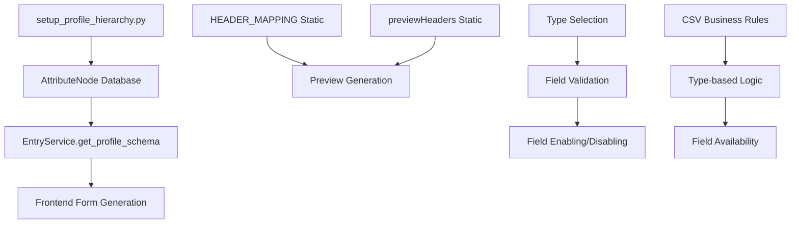

# Entry Page System Problems Analysis

## Executive Summary

The Windx Entry Page system was designed to be **schema-driven** and **fully dynamic**, but the current implementation has multiple hardcoded components that break this design principle. This document analyzes all problems, their root causes, dependencies, and provides a comprehensive roadmap to achieve true schema-driven architecture.

## Table of Contents

1. [Problem Overview](#problem-overview)
2. [Detailed Problem Analysis](#detailed-problem-analysis)
3. [Root Cause Analysis](#root-cause-analysis)
4. [Dependency Mapping](#dependency-mapping)
5. [Reproduction Steps](#reproduction-steps)
6. [Solution Architecture](#solution-architecture)
7. [Implementation Roadmap](#implementation-roadmap)

---

## Problem Overview

### Current State vs. Intended Design

| Component | Intended Design | Current Implementation | Impact |
|-----------|----------------|----------------------|---------|
| **Preview Headers** | Dynamic from schema | Hardcoded 29-column array | ❌ Cannot add new fields |
| **Field Mapping** | Schema-based | Hardcoded dictionary | ❌ Manual updates required |
| **Field Ordering** | Database `sort_order` | Inconsistent across components | ❌ Material/Company order wrong |
| **Field Availability** | Type-based business rules | Static display conditions | ❌ Invalid fields not disabled |
| **Column Count** | Dynamic from attribute nodes | Fixed at 29 columns | ❌ System breaks with new fields |
| **Search/Filter** | Dynamic for all columns | Not implemented | ❌ No search functionality |
| **Inline Edit Validation** | Field-type aware inputs | Text input for all fields | ❌ Can enter invalid data |
| **Error Messages** | Specific field errors | Generic "Validation Error" | ❌ Poor user experience |

### Severity Assessment

- 🔴 **Critical**: Hardcoded column count and mappings
- 🟡 **High**: Field ordering inconsistencies  
- 🟡 **High**: Missing Type-based field validation
- 🟠 **Medium**: No search/filter functionality
- � **Low**: *Inline edit validation missing
- 🟢 **Low**: Generic error messages in frontend
- 🟠 **Medium**: Code reusability issues

---

## Detailed Problem Analysis

### Problem 1: Hardcoded Preview Headers (Critical 🔴)

**File**: `app/static/js/profile-entry.js` (lines 1050+)

**Current Code**:
```javascript
get previewHeaders() {
    return [
        "Name", "Type", "Company", "Material", "opening system", "system series",
        // ... 29 hardcoded columns
    ];
}
```

**Issues**:
- ✗ Fixed array of 29 columns
- ✗ Cannot dynamically add new fields
- ✗ Headers don't match database schema
- ✗ Manual synchronization required

**Expected Behavior**:
- ✓ Generate headers from schema dynamically
- ✓ Automatically adapt to new fields
- ✓ Respect `sort_order` from database
- ✓ Handle any number of columns

---

### Problem 2: Hardcoded Backend Header Mapping (Critical 🔴)

**File**: `app/services/entry.py` (lines 870-897)

**Current Code**:
```python
HEADER_MAPPING = {
    "id": "id",
    "Name": "name",
    "Type": "type",
    "Company": "company",
    # ... 29 hardcoded mappings
}
```

**Issues**:
- ✗ Static dictionary with 29 entries
- ✗ Duplicates frontend logic
- ✗ Must be manually updated for new fields
- ✗ Inconsistent with schema generation

**Expected Behavior**:
- ✓ Generate mapping from attribute nodes
- ✓ Use field labels from database
- ✓ Automatically include new fields
- ✓ Single source of truth

---

### Problem 3: Field Ordering Inconsistency (High 🟡)

**Files**: 
- `scripts/setup_profile_hierarchy.py` (lines 90-120)
- `app/services/entry.py` (HEADER_MAPPING)
- `app/static/js/profile-entry.js` (previewHeaders)

**Current State**:
```python
# setup_profile_hierarchy.py
"material": {"sort_order": 4}
"company": {"sort_order": 3}

# But in HEADER_MAPPING and previewHeaders:
# "Company" appears before "Material"
```

**Issues**:
- ✗ Database says Material (3) before Company (4)
- ✗ Frontend/backend show Company before Material
- ✗ Inconsistent ordering across components
- ✗ `sort_order` not respected

**Expected Behavior**:
- ✓ All components use database `sort_order`
- ✓ Material appears before Company everywhere
- ✓ Consistent field ordering
- ✓ Single source of truth for ordering

---

### Problem 4: Missing Type-Based Field Validation (High 🟡)

**Files**: 
- `docs/profile table example data.csv` (shows business rules)
- `app/static/js/profile-entry.js` (isFieldValidForCurrentContext)
- `app/services/entry.py` (validation logic)

**Current State**:
```javascript
// profile-entry.js
isFieldValidForCurrentContext(field) {
    // Add logic here to determine if field is valid
    // For now, return true for all fields, but this can be extended
    return true;
}
```

**Business Rules from CSV**:
- `"Renovation only for frame"` → Only when Type = "Frame"
- `"builtin Flyscreen track only for sliding frame"` → Only for sliding frames
- `"Sash overlap only for sashs"` → Only when Type = "sash"
- `"Flying mullion horizontal clearance"` → Only when Type = "Flying mullion"
- `"Glazing undercut height only for glazing bead"` → Only when Type = "glazing bead"

**Issues**:
- ✗ All fields always enabled regardless of Type
- ✗ Users can enter invalid combinations
- ✗ Preview shows data for invalid fields
- ✗ No real-time field enabling/disabling

**Expected Behavior**:
- ✓ Fields disabled when Type doesn't support them
- ✓ Real-time enabling/disabling on Type change
- ✓ Preview shows N/A for invalid fields
- ✓ Backend validation prevents invalid saves

---

### Problem 4: Search Functionality Missing

1. **Create multiple configurations** with different names
2. **Navigate to preview tab**
3. **Try to search** for specific configuration
4. **Observe limitation**: No search functionality available

### Problem 5: Static Column Count (Critical 🔴)

**Files**: Multiple locations assume 29 columns

**Current Assumptions**:
```javascript
// Various places assume exactly 29 columns
assert len(preview_table.headers) == 29
// Hardcoded in tests and validation
```

**Issues**:
- ✗ System breaks if 30th column added
- ✗ Tests fail with different column counts
- ✗ No flexibility for different product types
- ✗ Cannot handle varying schemas

**Expected Behavior**:
- ✓ Dynamic column count based on schema
- ✓ Tests work with any number of columns
- ✓ Different manufacturing types can have different fields
- ✓ Graceful handling of schema changes

---

### Problem 5: Static Column Count (Critical �)

**Files**: Multiple locations assume 29 columns

**Current Assumptions**:
```javascript
// Various places assume exactly 29 columns
assert len(preview_table.headers) == 29
// Hardcoded in tests and validation
```

**Issues**:
- ✗ System breaks if 30th column added
- ✗ Tests fail with different column counts
- ✗ No flexibility for different product types
- ✗ Cannot handle varying schemas

**Expected Behavior**:
- ✓ Dynamic column count based on schema
- ✓ Tests work with any number of columns
- ✓ Different manufacturing types can have different fields
- ✓ Graceful handling of schema changes

---

### Problem 6: Missing Search and Filter Functionality (Medium 🟠)

**File**: `app/templates/admin/entry/profile.html.jinja`

**Current State**:
- No search input in preview table
- No column filtering capabilities
- No sorting functionality
- Static table display only

**Issues**:
- ✗ Cannot search through configurations
- ✗ No way to filter by column values
- ✗ Poor usability with large datasets
- ✗ No dynamic filtering

**Expected Behavior**:
- ✓ Search across all columns
- ✓ Filter by individual column values
- ✓ Sort by any column
- ✓ Dynamic filtering that works with any schema

---

### Problem 7: Inline Edit Validation Missing (Low 🟢)

**Files**: 
- `app/templates/admin/entry/profile.html.jinja` (inline edit template)
- `app/static/js/profile-entry.js` (startEditing, saveInlineEdit methods)
- `app/api/v1/endpoints/admin_entry.py` (update_preview_cell endpoint)

**Current State**:
```javascript
// profile-entry.js - No validation in inline editing
startEditing(rowId, field, value) {
    this.editingCell = {
        rowId: rowId,
        field: field,
        value: value === 'N/A' ? '' : value
    };
    // No field type checking or validation setup
}
```

**Issues**:
- ✗ Can input any string in `type` field (should be dropdown with options)
- ✗ No validation rules applied during inline editing
- ✗ Can enter invalid data that breaks business rules
- ✗ No field type awareness (text input for all fields)

**Expected Behavior**:
- ✓ Dropdown for fields with predefined options
- ✓ Number inputs for numeric fields with min/max validation
- ✓ Date pickers for date fields
- ✓ Validation rules applied before saving
- ✓ Field type-specific input controls

**Example Fix Needed**:
```javascript
// Should generate appropriate input based on field schema
getInlineEditInput(field, value) {
    const fieldDef = this.getFieldDefinition(field);
    
    if (fieldDef.validation_rules?.options) {
        // Return dropdown for fields with options
        return this.createDropdownInput(fieldDef.validation_rules.options, value);
    } else if (fieldDef.data_type === 'number') {
        // Return number input with validation
        return this.createNumberInput(fieldDef.validation_rules, value);
    } else {
        // Return text input with pattern validation
        return this.createTextInput(fieldDef.validation_rules, value);
    }
}
```

---

### Problem 8: Generic Error Messages in Frontend (Low 🟢)

**Files**:
- `app/static/js/profile-entry.js` (error handling in recordConfiguration, commitTableChanges)
- `app/api/v1/endpoints/admin_entry.py` (error responses)
- `app/services/entry.py` (ValidationException handling)

**Current State**:
```javascript
// profile-entry.js - Generic error handling
catch (err) {
    console.error('❌ Error recording configuration:', err);
    this.error = err.message;
    showToast(err.message, 'error', 8000);  // Generic "Validation Error"
}
```

**Backend provides detailed errors**:
```python
# entry.py - Detailed validation errors
raise ValidationException("Validation failed", field_errors={
    "type": "Type must be one of: Frame, sash, Mullion, Flying mullion, glazing bead",
    "width": "Width must be between 10 and 5000 mm",
    "material": "Material is required when type is Frame"
})
```

**Issues**:
- ✗ Frontend shows generic "Validation Error" message
- ✗ Detailed field errors from backend are lost
- ✗ Users don't know which fields are invalid
- ✗ No field-specific error highlighting in preview tab
- ✗ Same problem exists in both input and preview tabs

**Expected Behavior**:
- ✓ Show specific field error messages from backend
- ✓ Highlight invalid fields in both input and preview tabs
- ✓ Display multiple field errors clearly
- ✓ Provide actionable error messages to users

**Example Fix Needed**:
```javascript
// Better error handling with field-specific messages
catch (err) {
    if (err.status === 422 && err.detail?.field_errors) {
        // Handle field-specific validation errors
        this.fieldErrors = err.detail.field_errors;
        
        // Show detailed error message
        const errorList = Object.entries(err.detail.field_errors)
            .map(([field, msg]) => `• ${field}: ${msg}`)
            .join('\n');
        
        showToast(`Validation errors:\n${errorList}`, 'error', 10000);
        
        // Highlight fields in preview table if in preview tab
        this.highlightErrorFieldsInPreview(err.detail.field_errors);
    } else {
        // Generic error fallback
        showToast(err.message || 'An error occurred', 'error');
    }
}
```

---

### Problem 9: Template Code Duplication and Lack of Reusability (Medium 🟠)

**Files**: 
- `app/templates/admin/entry/profile.html.jinja` (current implementation)
- `app/templates/admin/entry/accessories.html.jinja` (scaffold)
- `app/templates/admin/entry/glazing.html.jinja` (scaffold)

**Current State**:
```jinja2
<!-- profile.html.jinja contains 400+ lines of hardcoded template logic -->

<!-- Entire form and preview logic hardcoded for profile page -->
<div x-data="profileEntryApp({ ... })">
    <!-- 400+ lines of profile-specific template code -->
</div>
```

**Issues**:
- ✗ 400+ lines of template code specific to profile page
- ✗ Cannot reuse for accessories/glazing pages without full duplication
- ✗ Hardcoded Alpine.js app name (`profileEntryApp`)
- ✗ Hardcoded navigation tabs and page titles
- ✗ Tight coupling to profile-specific logic
- ✗ Must duplicate entire template for each new entry type

**Expected Behavior**:
- ✓ Reusable base template (`entry.html.jinja`) for all entry types
- ✓ Parameterized template that accepts entry type configuration
- ✓ Generic Alpine.js app that works with any schema
- ✓ Easy to create new entry pages with minimal code
- ✓ Consistent UI/UX across all entry types

**Solution Architecture**:
```
app/templates/admin/entry/
├── entry.html.jinja          # Base reusable template
├── profile.html.jinja        # Extends entry.html.jinja
├── accessories.html.jinja    # Extends entry.html.jinja  
└── glazing.html.jinja        # Extends entry.html.jinja
```

**Base Template Structure**:
```jinja2
<!-- entry.html.jinja - Reusable base template -->



<div x-data="entryApp({
    entryType: '{{ entry_type }}',
    manufacturingTypeId: {{ manufacturing_type_id or 'null' }},
    canEdit: {{ can_edit|tojson }},
    canDelete: {{ can_delete|tojson }}
})" x-init="init()" class="space-y-6">

    <!-- Dynamic Navigation Tabs -->
    <div class="navigation-tabs">
        
        <a href="{{ tab.url }}" class="nav-tab {{ 'active' if tab.active else '' }}">
            {{ tab.icon }} {{ tab.title }}
        </a>
        
    </div>

    <!-- Dynamic Page Header -->
    <div class="bg-white rounded-lg shadow-md p-6">
        <div class="flex items-center justify-between">
            <div>
                <h1 class="text-2xl font-bold text-gray-900">{{ page_title }}</h1>
                <p class="text-gray-600 mt-1">{{ page_description }}</p>
            </div>
        </div>
    </div>

    <!-- Rest of template is generic and reusable -->
    <!-- ... -->
</div>

```

**Specific Page Implementation**:
```jinja2
<!-- profile.html.jinja - Minimal profile-specific code -->






```

---

### Problem 10: JavaScript App Coupling to Profile Logic (Medium 🟠)

**Files**:
- `app/static/js/profile-entry.js` (400+ lines of profile-specific code)

**Current State**:
```javascript
// profile-entry.js - Hardcoded for profile page only
function profileEntryApp(options = {}) {
    return {
        // 400+ lines of profile-specific logic
        // Cannot be reused for other entry types
    };
}
```

**Issues**:
- ✗ Function name hardcoded to `profileEntryApp`
- ✗ Logic assumes profile-specific schema and endpoints
- ✗ Cannot reuse for accessories or glazing pages
- ✗ Hardcoded API endpoints (`/api/v1/admin/entry/profile/...`)
- ✗ Must duplicate entire JavaScript file for new entry types

**Expected Behavior**:
- ✓ Generic `entryApp()` function that works with any entry type
- ✓ Parameterized API endpoints based on entry type
- ✓ Reusable JavaScript logic for all entry pages
- ✓ Easy to extend for new entry types

**Solution Architecture**:
```javascript
// generic-entry.js - Reusable for all entry types
function entryApp(options = {}) {
    const entryType = options.entryType || 'profile';
    
    return {
        entryType: entryType,
        
        // Dynamic API endpoints based on entry type
        get apiEndpoints() {
            return {
                schema: `/api/v1/admin/entry/${this.entryType}/schema/${this.manufacturingTypeId}`,
                save: `/api/v1/admin/entry/${this.entryType}/save`,
                previews: `/api/v1/admin/entry/${this.entryType}/previews/${this.manufacturingTypeId}`,
                // ... other endpoints
            };
        },
        
        // All other logic remains the same but uses dynamic endpoints
        async loadSchema() {
            const response = await fetch(this.apiEndpoints.schema);
            // ... rest of logic
        }
        
        // ... rest of reusable methods
    };
}
```

---

## Root Cause Analysis

### Primary Root Cause: Shortcut Implementation

The system was designed to be schema-driven, but **preview functionality was implemented with hardcoded shortcuts** to meet deadlines. This created a **dual architecture**:

1. **Form Generation**: Properly schema-driven using `generate_form_schema()`
2. **Preview Generation**: Hardcoded mappings bypassing the schema

### Secondary Root Causes

1. **Lack of Unified Data Flow**: Form and preview use different data sources
2. **Missing Business Rule Engine**: Type-based validation not systematically implemented  
3. **Incomplete Schema Definition**: Attribute nodes don't fully define UI behavior
4. **Testing Gaps**: Tests assume fixed structure instead of dynamic behavior

### Architectural Inconsistency

```
┌─────────────────┐    ┌─────────────────┐
│   Form System   │    │ Preview System  │
│  (Schema-driven)│    │  (Hardcoded)    │
└─────────────────┘    └─────────────────┘
         │                       │
         ▼                       ▼
┌─────────────────┐    ┌─────────────────┐
│ AttributeNode   │    │ HEADER_MAPPING  │
│ Database Schema │    │ Static Dict     │
└─────────────────┘    └─────────────────┘
```

**Should be**:
```
┌─────────────────────────────────────┐
│        Unified Schema System        │
└─────────────────────────────────────┘
                  │
                  ▼
┌─────────────────────────────────────┐
│         AttributeNode Schema        │
└─────────────────────────────────────┘
                  │
        ┌─────────┴─────────┐
        ▼                   ▼
┌─────────────┐    ┌─────────────┐
│ Form System │    │Preview System│
└─────────────┘    └─────────────┘
```

---

## Dependency Mapping

### Component Dependencies



### Breaking Changes Impact

| Change | Affected Components | Risk Level |
|--------|-------------------|------------|
| Add new field | 5+ files need manual updates | 🔴 High |
| Change field order | 3+ components inconsistent | 🟡 Medium |
| New product type | Hardcoded logic breaks | 🔴 High |
| Modify business rules | Manual code changes required | 🟡 Medium |

---

## Reproduction Steps

### Problem 1: Adding a New Field Breaks System

1. **Add new attribute node** in `setup_profile_hierarchy.py`:
   ```python
   {
       "name": "new_field",
       "description": "New Field",
       "sort_order": 30,
       # ... other properties
   }
   ```

2. **Run setup script**: `python scripts/setup_profile_hierarchy.py`

3. **Access profile page**: Navigate to `/api/v1/admin/entry/profile`

4. **Observe failures**:
   - Form shows new field (✓ works - schema-driven)
   - Preview table missing new column (❌ fails - hardcoded)
   - Tests fail expecting 29 columns (❌ fails - hardcoded)
   - Backend mapping doesn't include new field (❌ fails - hardcoded)

### Problem 2: Field Ordering Inconsistency

1. **Check database order**: Query `attribute_nodes` by `sort_order`
   ```sql
   SELECT name, sort_order FROM attribute_nodes 
   WHERE name IN ('material', 'company') 
   ORDER BY sort_order;
   ```

2. **Check frontend order**: View preview table headers

3. **Observe inconsistency**:
   - Database: material (3), company (4)
   - Frontend: Company appears before Material

### Problem 3: Type-Based Validation Missing

1. **Select Type = "sash"** in form
2. **Enter value in "Renovation" field** (should be disabled for sash)
3. **Save configuration**
4. **Observe issues**:
   - Field accepts invalid data (❌ should be disabled)
   - Preview shows renovation data for sash (❌ should show N/A)
   - No validation error (❌ should prevent save)

### Problem 7: Inline Edit Validation Missing

1. **Navigate to preview tab** with existing configurations
2. **Double-click on "Type" field** in any row
3. **Enter invalid value** like "InvalidType123"
4. **Press Enter to save**
5. **Observe issues**:
   - Field accepts any string (❌ should show dropdown with valid options)
   - No validation applied (❌ should reject invalid values)
   - Data saved with invalid type (❌ should prevent save)

### Problem 8: Generic Error Messages

1. **Fill form with invalid data**:
   - Type: "InvalidType"
   - Width: -50 (negative number)
   - Material: (leave empty but required)

2. **Click "Record to Database"**

3. **Observe error handling**:
   - Backend logs detailed field errors (✓ works)
   - Frontend shows generic "Validation Error" (❌ should show specific errors)
   - No field highlighting (❌ should highlight invalid fields)

4. **Try same in preview tab** with inline editing:
   - Same generic error behavior (❌ should show field-specific errors)

### Problem 9: Code Reusability Missing

### Problem 9: Template and JavaScript Reusability Missing

1. **Try to create accessories entry page** using existing code:
   ```bash
   # Current approach requires full duplication
   cp app/templates/admin/entry/profile.html.jinja app/templates/admin/entry/accessories.html.jinja
   cp app/static/js/profile-entry.js app/static/js/accessories-entry.js
   ```

2. **Modify copied files** for accessories:
   - Change `profileEntryApp` to `accessoriesEntryApp` (400+ lines to modify)
   - Update all API endpoints from `/profile/` to `/accessories/`
   - Modify page titles and navigation
   - Update template variables and logic

3. **Observe issues**:
   - Must duplicate 400+ lines of template code (❌ not maintainable)
   - Must duplicate 400+ lines of JavaScript code (❌ not reusable)
   - Any bug fix requires updating multiple files (❌ not scalable)
   - Inconsistent behavior across entry types (❌ not reliable)

4. **Repeat for glazing page**:
   - Same duplication process required
   - Now have 3 copies of identical logic
   - Maintenance nightmare with 1200+ lines of duplicated code

---

## Solution Architecture

### Unified Schema-Driven Architecture

```python
# New Architecture Flow
AttributeNode (Database)
    ↓
SchemaGenerator.generate_complete_schema()
    ↓
{
    "fields": [...],
    "headers": [...], 
    "mappings": {...},
    "business_rules": {...},
    "ui_config": {...}
}
    ↓
┌─────────────┐  ┌─────────────┐  ┌─────────────┐
│Form System  │  │Preview Sys  │  │Validation   │
│(Dynamic)    │  │(Dynamic)    │  │(Dynamic)    │
└─────────────┘  └─────────────┘  └─────────────┘
```

### Enhanced Attribute Node Schema

```python
# Extended AttributeNode properties needed
class AttributeNode:
    # Existing fields...
    
    # New fields for complete schema-driven system
    business_rules: dict  # Type-based availability rules
    ui_config: dict       # UI-specific configuration
    search_config: dict   # Search/filter configuration
    preview_config: dict  # Preview display configuration
```

### Dynamic Business Rules Engine

```python
# Type-based field availability rules
BUSINESS_RULES = {
    "renovation": {
        "available_for_types": ["Frame"],
        "condition": "type == 'Frame'"
    },
    "sash_overlap": {
        "available_for_types": ["sash"],
        "condition": "type == 'sash'"
    },
    "builtin_flyscreen_track": {
        "available_for_types": ["Frame"],
        "additional_conditions": ["opening_system.contains('sliding')"]
    }
}
```

---

## Implementation Roadmap

### Phase 1: Backend Schema Enhancement (Critical)

**Files to modify**:
- `app/services/entry.py`
- `scripts/setup_profile_hierarchy.py`

**Changes**:
1. **Remove hardcoded HEADER_MAPPING**
2. **Generate headers dynamically from schema**
3. **Add business rules to attribute nodes**
4. **Implement dynamic field availability logic**

**Code changes**:
```python
# Replace HEADER_MAPPING with dynamic generation
async def generate_dynamic_headers(self, manufacturing_type_id: int) -> dict:
    schema = await self.get_profile_schema(manufacturing_type_id)
    headers = []
    mapping = {}
    
    for section in schema.sections:
        for field in sorted(section.fields, key=lambda f: f.sort_order):
            headers.append(field.label)
            mapping[field.label] = field.name
    
    return {"headers": headers, "mapping": mapping}
```

### Phase 2: Frontend Dynamic Headers (Critical)

**Files to modify**:
- `app/static/js/profile-entry.js`

**Changes**:
1. **Remove hardcoded previewHeaders**
2. **Fetch headers from backend schema**
3. **Implement dynamic table generation**

**Code changes**:
```javascript
// Replace hardcoded previewHeaders
async loadDynamicHeaders() {
    const response = await fetch(`/api/v1/admin/entry/profile/headers/${this.manufacturingTypeId}`);
    const data = await response.json();
    this.dynamicHeaders = data.headers;
    this.headerMapping = data.mapping;
}

get previewHeaders() {
    return this.dynamicHeaders || [];
}
```

### Phase 3: Type-Based Field Validation (High Priority)

**Files to modify**:
- `scripts/setup_profile_hierarchy.py` (add business rules)
- `app/static/js/profile-entry.js` (implement validation)
- `app/services/entry.py` (backend validation)

**Changes**:
1. **Add business_rules to attribute nodes**
2. **Implement isFieldValidForCurrentContext()**
3. **Add real-time field enabling/disabling**

**Code changes**:
```python
# Add to setup_profile_hierarchy.py
"business_rules": {
    "available_for_types": ["Frame"],
    "conditions": [
        {"field": "type", "operator": "equals", "value": "Frame"}
    ]
}
```

```javascript
// Implement in profile-entry.js
isFieldValidForCurrentContext(field) {
    const currentType = this.formData.type;
    const businessRules = field.business_rules;
    
    if (!businessRules) return true;
    
    if (businessRules.available_for_types) {
        return businessRules.available_for_types.includes(currentType);
    }
    
    return true;
}
```

### Phase 4: Inline Edit Validation (Low Priority)

**Files to modify**:
- `app/static/js/profile-entry.js`
- `app/templates/admin/entry/profile.html.jinja`

**Changes**:
1. **Add field-type aware inline editing**
2. **Implement validation for inline edits**
3. **Create appropriate input controls per field type**

**Code changes**:
```javascript
// Add to profile-entry.js
getInlineEditInput(field, value) {
    const fieldDef = this.getFieldDefinition(field);
    
    if (fieldDef.validation_rules?.options) {
        return this.createDropdownInput(fieldDef.validation_rules.options, value);
    } else if (fieldDef.data_type === 'number') {
        return this.createNumberInput(fieldDef.validation_rules, value);
    } else {
        return this.createTextInput(fieldDef.validation_rules, value);
    }
}
```

### Phase 5: Enhanced Error Handling (Low Priority)

**Files to modify**:
- `app/static/js/profile-entry.js`

**Changes**:
1. **Parse detailed error responses from backend**
2. **Display field-specific error messages**
3. **Highlight invalid fields in both tabs**

**Code changes**:
```javascript
// Enhanced error handling
handleValidationError(error) {
    if (error.status === 422 && error.detail?.field_errors) {
        this.fieldErrors = error.detail.field_errors;
        
        const errorList = Object.entries(error.detail.field_errors)
            .map(([field, msg]) => `• ${field}: ${msg}`)
            .join('\n');
        
        showToast(`Validation errors:\n${errorList}`, 'error', 10000);
        this.highlightErrorFields();
    }
}
```

### Phase 6: Search and Filter Implementation (Medium Priority)

**Files to modify**:
- `app/templates/admin/entry/profile.html.jinja`
- `app/static/js/profile-entry.js`

**Changes**:
1. **Add search input to template**
2. **Implement dynamic filtering**
3. **Add column-specific filters**

### Phase 7: Template and JavaScript Reusability Refactor (Medium Priority)

**Files to create/modify**:
- `app/templates/admin/entry/entry.html.jinja` (new base template)
- `app/static/js/generic-entry.js` (new reusable JavaScript)
- `app/templates/admin/entry/profile.html.jinja` (refactor to extend base)
- `app/templates/admin/entry/accessories.html.jinja` (refactor to extend base)
- `app/templates/admin/entry/glazing.html.jinja` (refactor to extend base)

**Changes**:
1. **Create reusable base template (`entry.html.jinja`)**
2. **Create generic JavaScript app (`generic-entry.js`)**
3. **Refactor existing pages to use base template**
4. **Implement parameterized entry type system**

**Base Template Creation**:
```jinja2
<!-- app/templates/admin/entry/entry.html.jinja -->



<div x-data="entryApp({
    entryType: '{{ entry_type }}',
    manufacturingTypeId: {{ manufacturing_type_id or 'null' }},
    canEdit: {{ can_edit|tojson }},
    canDelete: {{ can_delete|tojson }}
})" x-init="init()" class="space-y-6">

    <!-- Dynamic Navigation -->
    <div class="navigation-tabs">
        
        <a href="{{ tab.url }}" class="nav-tab {{ 'active' if tab.active else '' }}">
            {{ tab.icon }} {{ tab.title }}
        </a>
        
    </div>

    <!-- Dynamic Header -->
    <div class="bg-white rounded-lg shadow-md p-6">
        <h1 class="text-2xl font-bold text-gray-900">{{ page_title }}</h1>
        <p class="text-gray-600 mt-1">{{ page_description }}</p>
    </div>

    <!-- Reusable form and preview logic -->
    <!-- ... (move all generic logic from profile.html.jinja) -->
</div>

```

**Generic JavaScript Creation**:
```javascript
// app/static/js/generic-entry.js
function entryApp(options = {}) {
    const entryType = options.entryType || 'profile';
    
    return {
        entryType: entryType,
        
        get apiEndpoints() {
            return {
                schema: `/api/v1/admin/entry/${this.entryType}/schema/${this.manufacturingTypeId}`,
                save: `/api/v1/admin/entry/${this.entryType}/save`,
                previews: `/api/v1/admin/entry/${this.entryType}/previews/${this.manufacturingTypeId}`,
            };
        },
        
        // All existing logic but with dynamic endpoints
        // ... (move all logic from profile-entry.js)
    };
}
```

**Refactored Profile Page**:
```jinja2
<!-- app/templates/admin/entry/profile.html.jinja -->






```

**New Accessories Page**:
```jinja2
<!-- app/templates/admin/entry/accessories.html.jinja -->






```

### Phase 8: Testing and Validation (All Phases)

**Files to modify**:
- All test files in `tests/`

**Changes**:
1. **Remove hardcoded column count assumptions**
2. **Add dynamic schema testing**
3. **Test business rule validation**
4. **Add integration tests for new functionality**

---

## Success Criteria

### Functional Requirements

- ✅ **Dynamic Column Count**: System works with any number of fields
- ✅ **Correct Field Ordering**: Material appears before Company everywhere
- ✅ **Type-Based Validation**: Fields disabled when not applicable
- ✅ **Inline Edit Validation**: Proper input controls and validation for inline editing
- ✅ **Clear Error Messages**: Specific field errors displayed to users
- ✅ **Search Functionality**: Can search and filter all columns
- ✅ **Template Reusability**: Base template system for all entry types
- ✅ **JavaScript Reusability**: Generic entry app for all schemas
- ✅ **Easy Entry Type Creation**: New entry pages with minimal code
- ✅ **Code Reusability**: Can easily create new entry pages

### Technical Requirements

- ✅ **Single Source of Truth**: All components use database schema
- ✅ **No Hardcoded Mappings**: Everything generated dynamically
- ✅ **Consistent Architecture**: Form and preview use same data flow
- ✅ **Maintainable Code**: Easy to add new fields and rules

### Performance Requirements

- ✅ **Fast Loading**: Schema generation < 100ms
- ✅ **Responsive UI**: Field updates < 50ms
- ✅ **Efficient Queries**: Minimal database calls

---

## Risk Assessment

### High Risk Changes

1. **Backend Header Mapping Removal**: Could break existing functionality
   - **Mitigation**: Implement with feature flags and gradual rollout

2. **Frontend Dynamic Headers**: Major JavaScript refactoring required
   - **Mitigation**: Maintain backward compatibility during transition

### Medium Risk Changes

1. **Business Rules Implementation**: Complex validation logic
   - **Mitigation**: Extensive testing with all Type combinations

2. **Database Schema Changes**: May require migrations
   - **Mitigation**: Use additive changes, avoid breaking modifications

### Low Risk Changes

1. **Search/Filter Addition**: Pure enhancement, no breaking changes
2. **Code Refactoring**: Internal improvements, external API unchanged

---

## Conclusion

The Entry Page system requires a comprehensive refactoring to achieve its intended schema-driven architecture. The current hardcoded implementations create maintenance burden and prevent the system from scaling to new requirements.

The proposed solution maintains the existing API while implementing true dynamic behavior based on the database schema. This will enable:

- **Effortless field additions** without code changes
- **Consistent field ordering** across all components  
- **Proper business rule validation** based on Type selection
- **Enhanced user experience** with search and filtering
- **Maintainable, reusable code** for future entry pages

The implementation should be done in phases to minimize risk and ensure thorough testing at each stage.